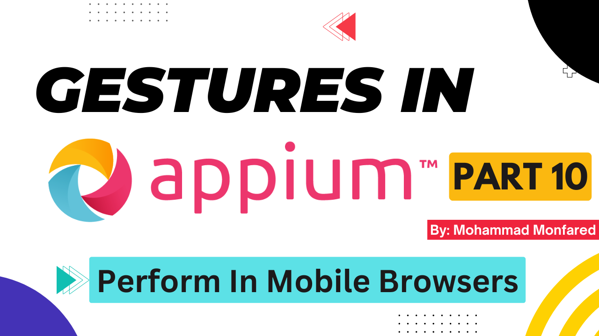
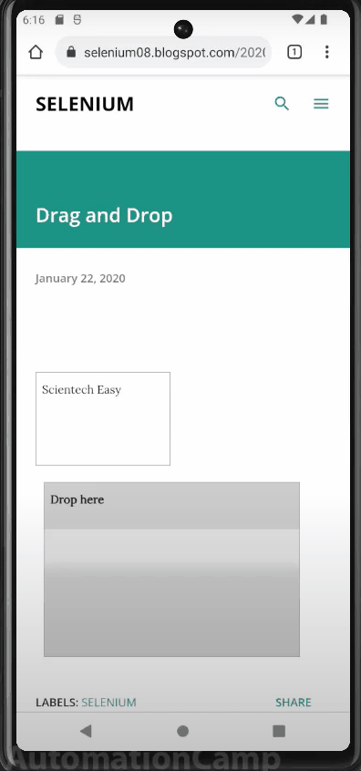

+++
title = 'Gestures in Appium - Part 10- Perform gestures in Mobile Web Browsers'
date = 2024-03-16T08:00:00+01:00
draft = false
tags = [
    "appium",
    "gestures",
]
categories = [
    "Mobile Automation"
]
series = ["Appium Gestures"]
+++

<p align="center" width="100%">
    
</p>

## Overview

This is the tenth part of the complete Gestures guide in the Appium series. So far, we've covered all possible gestures in native mobile applications. But what if we want to perform gestures in mobile browsers like Chrome Mobile? This means doing actions on websites opened by mobile browsers. Or what if that page is in a WebView context (in a Hybrid App)?

Actually, it's the same as using Selenium, since we are automating a web page. The only difference is to use the `AppiumBy` class instead of the `By` class. Also, we need to pass the driver binary.

<p align="center" width="100%">
    
</p>

## Set Chrome Driver's binary path

We know it's required to specify the browser's driver binary in Selenium. But after version 4.6, they introduced **SeleniumManager**. It combines all the older driver manager libraries and can download and set up the right driver automatically if we don't define where it is located.
For mobile web browsers in Appium, managing the driver file is also mandatory. We can either tell Appium where to find the driver binary file or let it download and automatically set the right version it needs for the browser. So, we have three ways to do this:

1. **Let Appium download and handle the driver's binary automatically** by passing a flag to the Appium server. To do this we should run the following command to start the server instead of a single `appium` command

```shell
appium server --allow-insecure chromedriver_autodownload
```
2. **Manually download the driver binary from the [official website]https://googlechromelabs.github.io/chrome-for-testing/)** and copy it to the following path on your system. (The `win` folder at the end indicates it's for Windows since I'm on Windows now; for Mac and Linux, the last directory will be `mac` and `linux` ):

```shell
/USER_HOME/.appium/node_modules/appium-uiautomator2-driver/node_modules/appium-chromedriver/chromedriver/win
``` 

Note that if you are using Chrome version under 115, you should download the driver binary from [here](https://chromedriver.chromium.org/downloads).

3. **Add `"chromedriverExecutable: <DRIVER_PATH>"` to desired caps appium options**

```python
desired_caps = {
    "platformName": "Android",
    "browserName": "Chrome",
    "appium:options": {
        "automationName": "UiAutomator2",
        "chromedriverExecutable": "C:/chromedriver.exe"  # This line
    }
}
```
## Drag and Drop on Chrome Mobile Browser

```python
from appium import webdriver
from appium.webdriver.common.appiumby import AppiumBy
from appium.options.android import UiAutomator2Options
from selenium.webdriver.common.action_chains import ActionChains

appium_options = UiAutomator2Options().load_capabilities(desired_caps.chrome)
driver = webdriver.Remote(appium_server, options=appium_options)
driver.get("https://selenium08.blogspot.com/2020/01/drag-drop.html")

el1 = driver.find_element(AppiumBy.CSS_SELECTOR, '#draggable')
el2 = driver.find_element(AppiumBy.CSS_SELECTOR, '#droppable')

actions = ActionChains(driver)
actions.w3c_actions.pointer_action.click_and_hold(el1)
actions.w3c_actions.pointer_action.pause(1)
actions.w3c_actions.pointer_action.move_to(el2)
actions.w3c_actions.pointer_action.release()
actions.perform()
``` 
First, we create an instance of the `ActionChains` class:

```python
actions = ActionChains(driver)
``` 
Next, we define our gesture steps. We choose `w3c_actions` to build our W3C-compatible gesture, followed by the `pointer_action` property since our input is a Pointer (left/right click of mouse, or touch), not a Mouse Wheel or Keyboard. I explained this `inputs` in detail in [Part 8](https://blog.monfared.io/gestures-in-appium-part8-zoom-pinch). Ending with actions for each step.

```python
actions.w3c_actions.pointer_action.click_and_hold(el1)
actions.w3c_actions.pointer_action.pause(1)
actions.w3c_actions.pointer_action.move_to(el2)
actions.w3c_actions.pointer_action.release()
```
And finally, we perform all defined actions to be executed:

```python
actions.perform()
``` 
Thank you for taking the time to read. If you enjoyed the post, please leave your reactions, comments, and questions. Your feedback is greatly appreciated!

In the next article (which is the last one of this series), we will explore an interesting feature of **Appium Inspector** that is used to create mobile gestures!

*Previous*: [Part 9 - Gestures Plugin](https://blog.monfared.io/gestures-in-appium-part9-plugin)

*Next*: [Part 11 - Use Appium Inspector to Create Gestures](https://blog.monfared.io/gestures-in-appium-part11-use-appium-inspector-to-create-gestures)

Follow me on LinkedIn: https://www.linkedin.com/in/mohammad-monfared/

Happy testing ✌️