+++
title = 'Gestures in Appium - Part 11 - Use Appium Inspector to Create Gestures'
date = 2024-03-17T08:00:00+01:00
draft = false
tags = [
    "appium",
    "gestures",
]
categories = [
    "Mobile Automation"
]
series = ["Appium Gestures"]
+++

    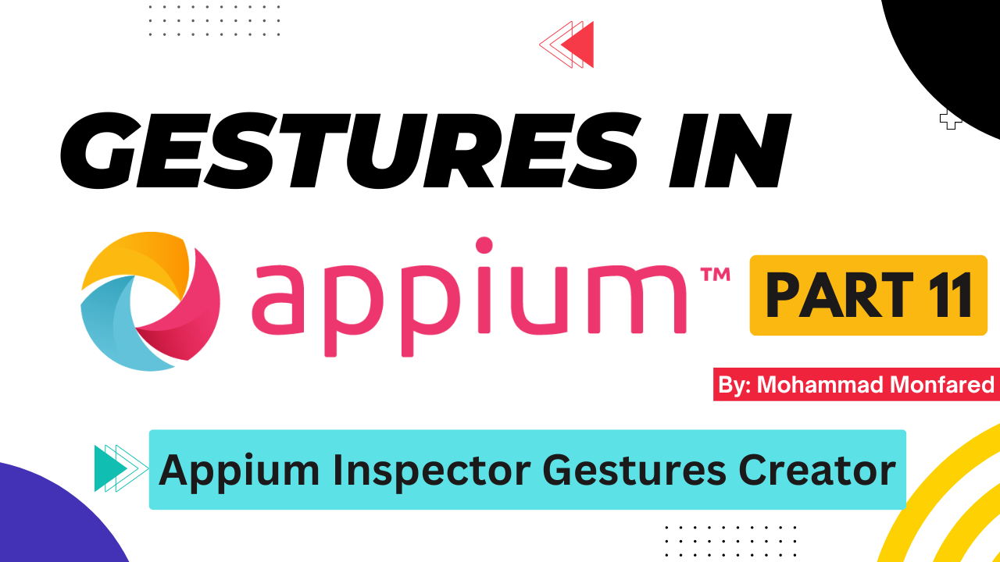

## Overview
This is the eleventh part (last one) of the complete Gestures guide in the Appium series. 

Did you know that there's a very interesting feature in the Appium Inspector designed to create gestures for us? It's like drawing gestures on your app screen!

## What is Appium Inspector? 

I'm pretty sure that the reader is familiar with this tool since it's used to locate elements, and we use it from day one in mobile automation. However, for those who don't know, it's a desktop application (available on Windows, Mac, and Linux) used to locate elements of the application and write locators. 

Link to the project: https://github.com/appium/appium-inspector

Documentation: https://appium.github.io/appium-inspector/latest/

<figure style="text-align: center;">
    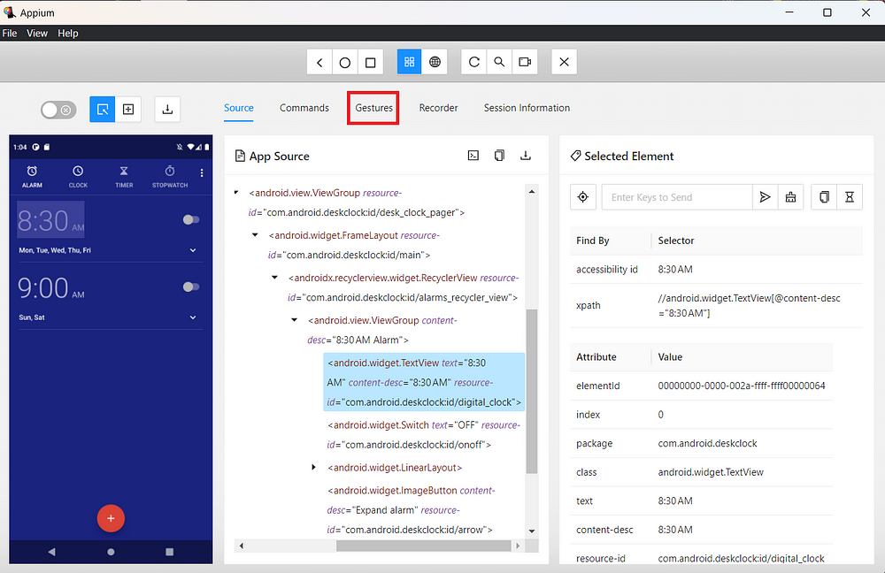
    <figcaption>Appium Inspector - Gestures Builder</figcaption>
</figure>

You can familiarize yourself with this app in its GitHub repo and official documentation, especially the **[Gestures](https://appium.github.io/appium-inspector/latest/session-inspector/gestures/)** tab which we are going to use here.

In this demo, we're going to perform a Zoom In (Pinch) on Google Maps, similar to what we did in [Part 8](https://blog.monfared.io/gestures-in-appium-part8-zoom-pinch).

## Creating Pointers

In Appium Inspector, you can create as many pointers as you want to represent the fingers. We need two fingers to perform a Zoom, one moving to the left and one to the right.

<figure style="text-align: center;">
    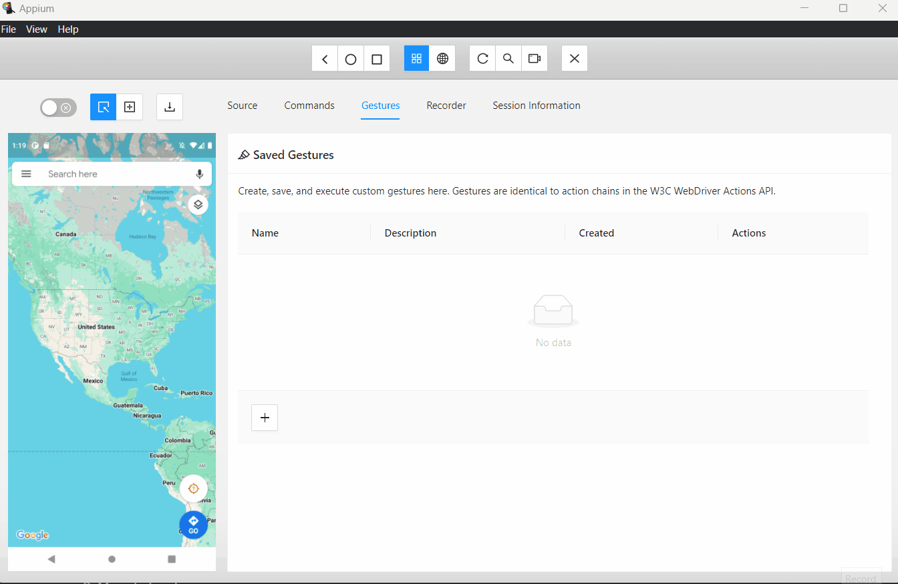
    <figcaption>Appium Gestures Builder - Creating Pointers</figcaption>
</figure>

## Adding Actions

As mentioned in [Part 8](https://blog.monfared.io/posts/gestures-in-appium-part8-zoom-pinch), we should perform a drag for each finger in the opposite direction (Move > Pointer Down > Move > Pointer Up). 

For each action, we add an action card and then we set the Action Type. Next, we should choose the points on the map. It can be a percentage of the screen bonding area (**%**) or simply coordinates in pixels (**px**). You can see there is a button on the app to switch between these units. You can also type them manually (when you move the mouse, on the left top of the screen, the current hover coordinates are shown). Additionally, we can set **Duration** in milliseconds and **left/right** button if applicable, which you can see in the action card.

<figure style="text-align: center;">
    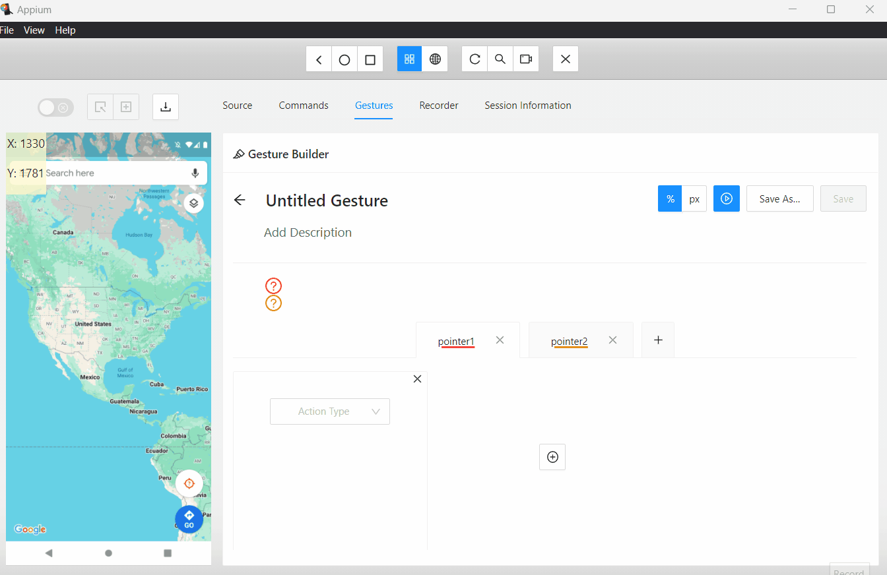
    <figcaption>Appium Gestures Builder - Adding Actions</figcaption>
</figure>

Now let's finish the actions for our left finger.

<figure style="text-align: center;">
    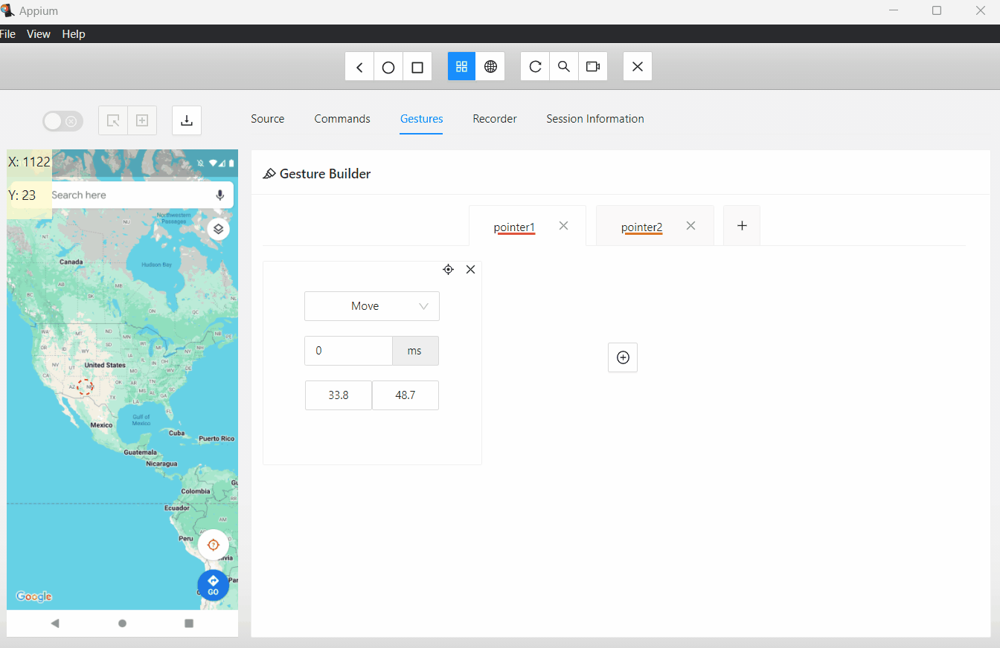
    <figcaption>Appium Gestures Builder - Adding Actions</figcaption>
</figure>

The same for the second finger (right):

<figure style="text-align: center;">
    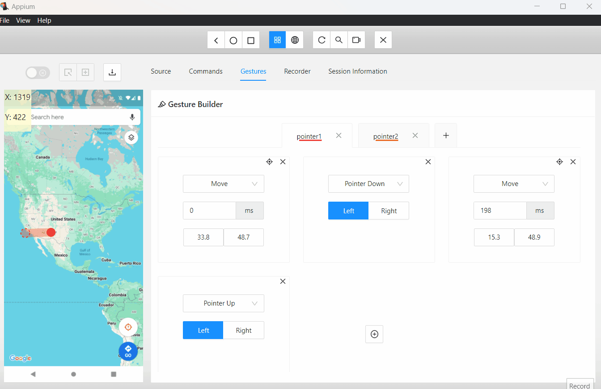
    <figcaption>Appium Gestures Builder - Adding Actions</figcaption>
</figure>

At the end, you'll see a timeline for each finger, which shows the steps of the gestures. Pay attention to the arrow direction (up for Pointer Up, down for Pointer Down, and right for Move). Additionally, by hovering the mouse over each step, you will see the details related to that step.

<figure style="text-align: center;">
    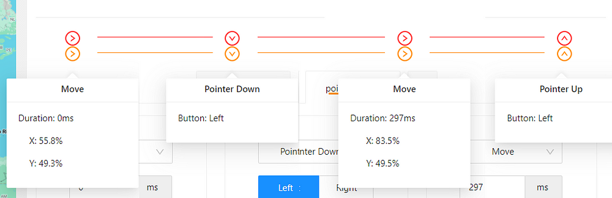
    <figcaption>Appium Gestures Builder - Timeline</figcaption>
</figure>

To fine-tune the gesture, you may manually change the values of the coordinates. We can set all `y` coordinates equal to each other (as explained in [Part 8](https://blog.monfared.io/posts/gestures-in-appium-part8-zoom-pinch)) and make the drag distance of each finger equal but in opposite directions. For example, `+400px` and `-400px`.

In my case, I changed them to the following:

- Finger 1 > (500, 1300) to (300, 1300)
- Finger 2 > (800, 1300) to (1100, 1300)

With a duration of 50 milliseconds for each move action.

<figure style="text-align: center;">
    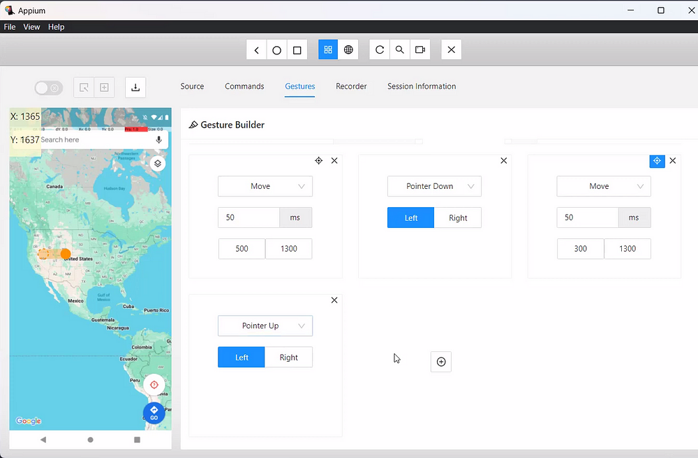
    <figcaption>Finger 1 - Final Actions</figcaption>
</figure>

<figure style="text-align: center;">
    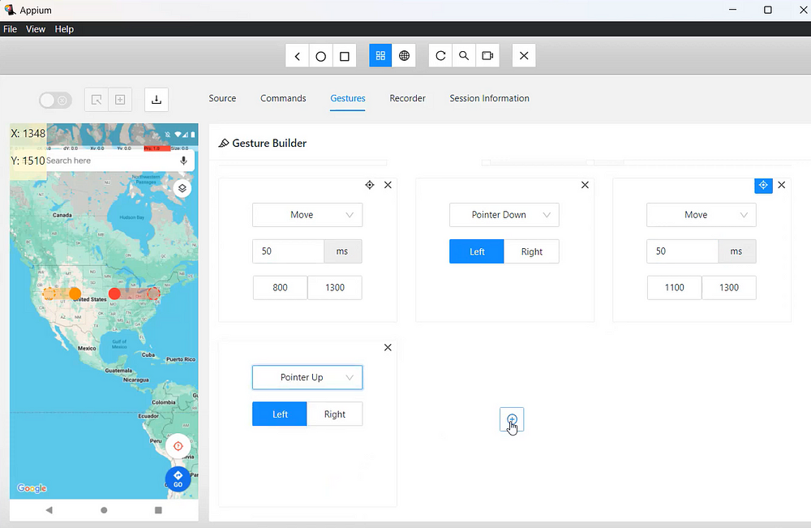
    <figcaption>Finger 2 - Final Actions</figcaption>
</figure>

## Saving the Gesture
By clicking on **Save As** this gesture will be saved in the list, and you can rename, delete, or add a description later.

<figure style="text-align: center;">
    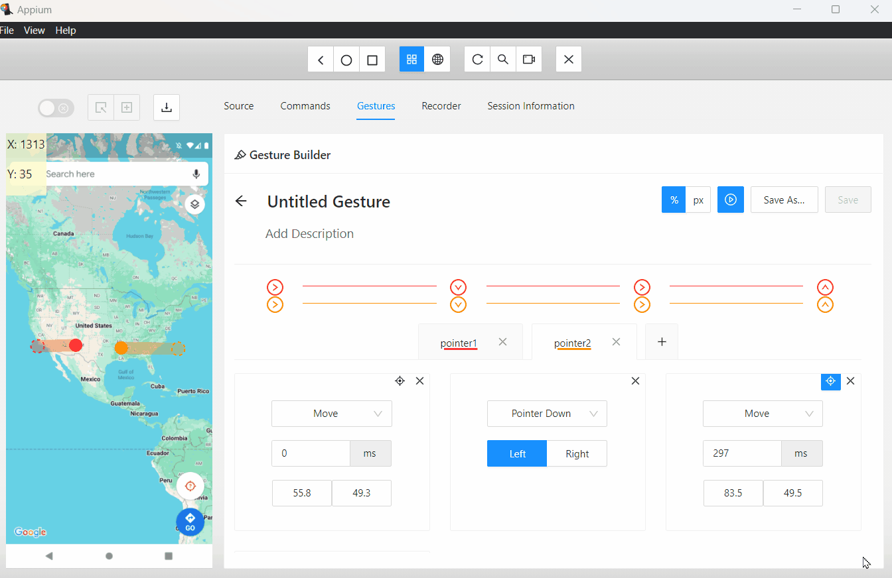
    <figcaption>Appium Gestures Builder - Saving Gestures</figcaption>
</figure>

## Running the Gesture on the App

You can run the Gesture by clicking the Play button located in the Builder panel or Saved list. Keep the emulator visible to see the gesture.

<figure style="text-align: center;">
    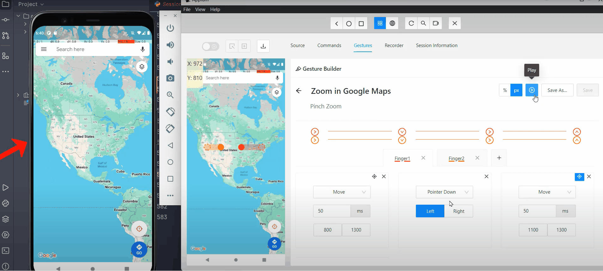
    <figcaption>Appium Gestures Builder - Running Gestures</figcaption>
</figure>

Thank you for reading the final part of the "**Gestures in Appium**" series. I hope it was helpful for you.

*Previous*: [Part 10 - Perform gestures in Mobile Web Browsers](https://blog.monfared.io/posts/gestures-in-appium-part10-perform-gestures-in-mobile-web-browsers)

If you enjoyed the post, please leave your reactions, comments, and questions. Your feedback is greatly appreciated!

Follow me on LinkedIn: https://www.linkedin.com/in/mohammad-monfared/

Happy testing ✌️

