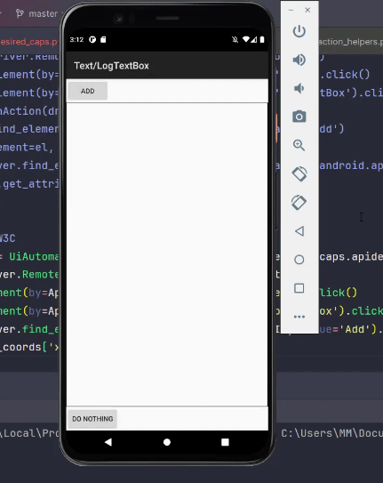

+++
title = 'Gestures in Appium - Part 2 - Tap | Double Tap | Multi-finger Tap'
date = 2024-01-15T08:00:00+01:00
draft = false
tags = [
    "appium",
    "gestures",
]
categories = [
    "Mobile Automation"
]
series = ["Appium Gestures"]
+++

<p align="center" width="100%">
    
</p>

## Overview
In the second part of the "**Gestures in Appium**" series I will cover all the different methods to perform '**Tap**', '**Multi-finger Tap**' and '**Double Tap**'
### What is tapping? 
We use our fingers to touch the device. Tapping is quickly touching the device with a bit of pressure, similar to clicking with a mouse.
### So what is the difference between Tap, Click, and Press?
Well, Clicking involves using input devices like a Mouse or Trackpad, while on mobile devices, we use our fingers to touch the screen, which is why it's referred to as 'Tap' instead of 'Click'.
'Press' can mean two different things: pressing a keyboard button or holding down on the touch screen. In iOS devices, the amount of pressure applied also matters, as it can perform extra actions on the pressed element.

### Tap (Single | Multi-finger) using W3C Actions API

```python
from appium import webdriver
from appium.webdriver.common.appiumby import AppiumBy
from appium.options.android import UiAutomator2Options
import desired_caps # Explained in Part 1

appium_options = UiAutomator2Options().load_capabilities(desired_caps.apidemos)
driver = webdriver.Remote(appium_server, options=appium_options)
driver.find_element(by=AppiumBy.ACCESSIBILITY_ID, value='Views').click()
driver.find_element(by=AppiumBy.ACCESSIBILITY_ID, value='Controls').click()
driver.find_element(by=AppiumBy.ACCESSIBILITY_ID, value='1. Light Theme').click()

# Tap on Checkbox 1
driver.tap([(0, 596)])

# Multi-finger tap on 5 more coordinations
driver.tap([(0, 840), (0, 1008), (0, 1344), (0, 1456), (0, 1615)])
```
<p align="center" width="100%">
    
</p>

The `driver.tap()` is a command associated with the `ActionHelpers` class which is created using `ActionBuilder` (specifically `ActionChains.w3c_actions()`) and is accessible through the driver object. It accepts list of tuples (Up to 5) for positions as the first argument and the duration in milliseconds for the second argument which defines how long the action should be take to perform (default is 100ms).

```python
def tap(self, positions: List[Tuple[int, int]], duration: Optional[int] = None) -> 'WebDriver':
```
Each tuple represents the point at which the finger should be tapped. To perform a multi-finger tap, you can specify multiple tuples representing the positions of each finger in the list passed to `driver.tap()`
In the above example, we first tap on (0, 596) which is the coordination of `Checkbox 1` . After that, we perform a Multi-finger tap on five more elements.

## Tap (Single) using TouchAction class

```python
from appium import webdriver
from appium.webdriver.common.appiumby import AppiumBy
from appium.options.android import UiAutomator2Options
import desired_caps # Explained in Part 1
from appium.webdriver.common.touch_action import TouchAction

appium_options = UiAutomator2Options().load_capabilities(desired_caps.apidemos)
driver = webdriver.Remote(appium_server, options=appium_options)
driver.find_element(by=AppiumBy.ACCESSIBILITY_ID, value='Views').click()
driver.find_element(by=AppiumBy.ACCESSIBILITY_ID, value='Controls').click()
driver.find_element(by=AppiumBy.ACCESSIBILITY_ID, value='1. Light Theme').click()

# Create an instance from TouchAction class
action = TouchAction(driver)

# Call the action (tap) and perform
action.tap(x=0, y=596).perform()
```
To perform actions using the TouchAction class (which is deprecated and going to be removed from Appium), we first need to create an instance of it by passing a driver object to it.

```python
# Create an instance from TouchAction class
action = TouchAction(driver)
```
Then we call the action we want (which can be chained together, we will see later) and finally, we call the `perform()` method at the end. We should either pass the coordination (x, y) or `element` object to the `tap()` method.

```python
# Call the action (tap) and perform
action.tap(x=0, y=596).perform()
```
Is it possible to perform a Multi-finger tap using this library? Sure, let's make a hand of fingers!

## Tap (Multi-finger) using TouchAction and MultiAction classes

```python
from appium import webdriver
from appium.webdriver.common.appiumby import AppiumBy
from appium.options.android import UiAutomator2Options
import desired_caps # Explained in Part 1
from appium.webdriver.common.touch_action import TouchAction
from appium.webdriver.common.multi_action import MultiAction

appium_options = UiAutomator2Options().load_capabilities(desired_caps.apidemos)
driver = webdriver.Remote(appium_server, options=appium_options)
driver.find_element(by=AppiumBy.ACCESSIBILITY_ID, value='Views').click()
driver.find_element(by=AppiumBy.ACCESSIBILITY_ID, value='Controls').click()
driver.find_element(by=AppiumBy.ACCESSIBILITY_ID, value='1. Light Theme').click()

# Create a instance of TouchAction for each finger
action1 = TouchAction(driver) # Finger 1
action2 = TouchAction(driver) # Finger 2
action3 = TouchAction(driver) # Finger 3

# Call the actions
action1.tap(x=0, y=596)
action2.tap(x=0, y=840)
action3.tap(x=0, y=1008)

# Add and Perform together using MultiAction
multi_action = MultiAction(driver)
multi_action.add(action1, action2, action3)
multi_action.perform()
```
To perform multi-finger tap using the TouchAction class, we rely on another class called MultiAction which does the magic. Let's break it down into steps:
We start by creating a new instance of the TouchAction class for each finger. (We pass the same driver instance to all of them)

```python
# Create an instance of TouchAction for each finger

action1 = TouchAction(driver) # Finger 1
action2 = TouchAction(driver) # Finger 2
action3 = TouchAction(driver) # Finger 3
```
Next, we assign an action to each instance, specifying the tapping points for each finger. It is not performed yet.

```python
# Call the actions

action1.tap(x=0, y=596)
action2.tap(x=0, y=840)
action3.tap(x=0, y=1008)
```

Then we make an instance of the MultiAction class (and pass the driver object to it)

```python
# Create an instance from MultiAction class

multi_action = MultiAction(driver)
```
Next, using `add()` method of the MultiAction class, we add all instances of TouchAction object (fingers). It is like a To-Do list of actions that should be performed together.

```python
# Make a hand of fingers :) 

multi_action.add(action1, action2, action3)
```
Finally, we perform all actions together. They execute simultaneously.

```python
# Perform all actions together
multi_action.perform()
```
## Double Tap using TouchAction
It is quite straightforward to perform a Double Tap using the TouchAction class. The `tap()` method includes an argument called `count` which allows you to specify the number of taps you want to perform on the element. As mentioned before you should either pass the element object (`element`) or a coordination on the page (`x` and `y`).

```python
from appium import webdriver
from appium.webdriver.common.appiumby import AppiumBy
from appium.options.android import UiAutomator2Options
import desired_caps # Explained in Part 1

appium_options = UiAutomator2Options().load_capabilities(desired_caps.apidemos)
driver = webdriver.Remote(appium_server, options=appium_options)
driver.find_element(by=AppiumBy.ACCESSIBILITY_ID, value='Text').click()
driver.find_element(by=AppiumBy.ACCESSIBILITY_ID, value='LogTextBox').click()

action = TouchAction(driver)

# Find the element an assign its object to a value 
el = driver.find_element(by=AppiumBy.ACCESSIBILITY_ID, value='Add')

# Tapping on it two times (count=2)
action.tap(element=el, count=2).perform()

text_el = driver.find_element(by=AppiumBy.ID, value='io.appium.android.apis:id/text')
print(text_el.get_attribute('text')) # This is a test \n This is a test
```
<p align="center" width="100%">
    
</p>

## Double Tap using W3C Actions API

Unlike the `TouchAction` class, the `ActionHelper` as of the date of writing this article, does not currently have a method like `double_tap()` or a similar parameter like `count` to specify the number of taps. However, you can simulate a double tap by quickly executing two tap actions. For example:

```python
from appium import webdriver
from appium.webdriver.common.appiumby import AppiumBy
from appium.options.android import UiAutomator2Options
import desired_caps # Explained in Part 1

appium_options = UiAutomator2Options().load_capabilities(desired_caps.apidemos)
driver = webdriver.Remote(appium_server, options=appium_options)
driver.find_element(by=AppiumBy.ACCESSIBILITY_ID, value='Text').click()
driver.find_element(by=AppiumBy.ACCESSIBILITY_ID, value='LogTextBox').click()

# Get elements coordinations (Explained in Part 1)
el_coords = driver.find_element(by=AppiumBy.ACCESSIBILITY_ID, value='Add').location

# Perform quickly two taps
driver.tap([(el_coords['x'], el_coords['y'])])
driver.tap([(el_coords['x'], el_coords['y'])])

text_el = driver.find_element(by=AppiumBy.ID, value='io.appium.android.apis:id/text')
print(text_el.get_attribute('text')) # This is a test \n This is a test
```
## Double Tap using W3C Mobile Gestures Commands

As mentioned in [Part 1](https://blog.monfared.io/gestures-in-appium-part1-history-rectangular-w3c-actions), the `Mobile Gestures Commands` are not only rich but also work perfectly in most cases, making them my favorite! Let's see how simple it is to perform a double tap using these commands:

```python
from appium import webdriver
from appium.webdriver.common.appiumby import AppiumBy
from appium.options.android import UiAutomator2Options
import desired_caps # Explained in Part 1

appium_options = UiAutomator2Options().load_capabilities(desired_caps.apidemos)
driver = webdriver.Remote(appium_server, options=appium_options)
driver.find_element(by=AppiumBy.ACCESSIBILITY_ID, value='Text').click()
driver.find_element(by=AppiumBy.ACCESSIBILITY_ID, value='LogTextBox').click()

# Get element's coordinates (Explained in Part 1)
el_coords = driver.find_element(by=AppiumBy.ACCESSIBILITY_ID, value='Add').location

# Perform double tap using mobile gestures commands
driver.execute_script('mobile: doubleClickGesture', {'x': el_coords['x'], 'y': el_coords['y']})

text_el = driver.find_element(by=AppiumBy.ID, value='io.appium.android.apis:id/text')
print(text_el.get_attribute('text')) # This is a test \n This is a test
```
As documented here, we have 3 options to pass. We either should pass the elementId (element object returned from `find_element()` method), locator and strategy (it will find the element itself) or `x`and `y` offset coordinates of the element we want to perform double tap on. In the above example, we retrieve the element's offsets and execute the command by passing them to the command's (x, y) arguments.

Thank you for taking the time to read. If you enjoyed the post, please leave your reactions, comments, and questions. Your feedback is greatly appreciated!

In the next article, we will talk about the **Press and Hold (Long-Press)** gesture. 

**Previous**: [Part 1 - History | Element/Display Rectangular | W3C ActionsAPI](https://blog.monfared.io/gestures-in-appium-part1-history-rectangular-w3c-actions)

**Next**: [Part 3 - Press and Hold (Long Press)](https://blog.monfared.io/gestures-in-appium-part3-press-and-hold-long-press)

Follow me on LinkedIn: https://www.linkedin.com/in/mohammad-monfared/

Happy testing ✌️