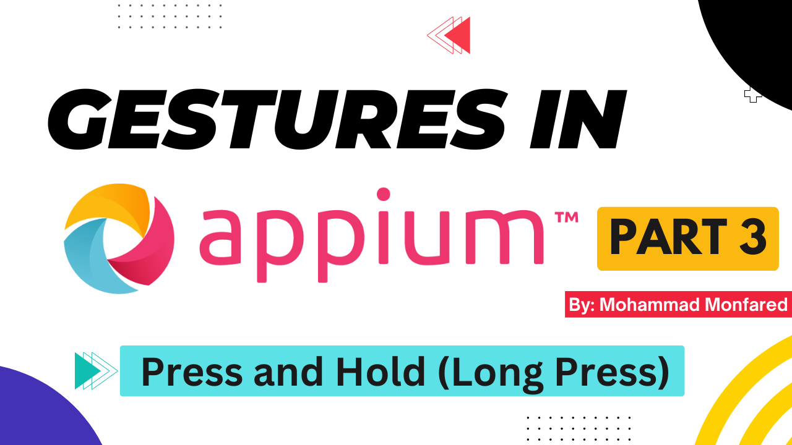
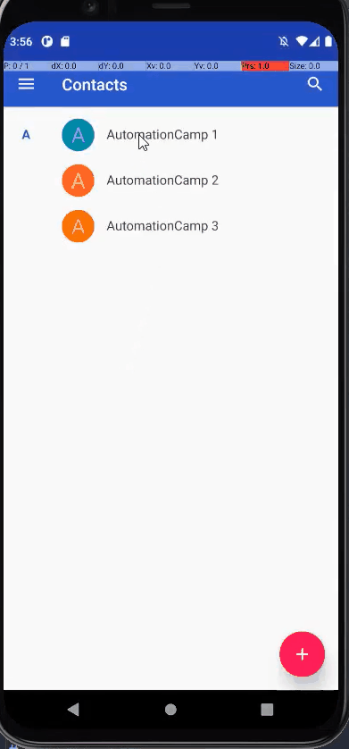

+++
title = 'Gestures in Appium - Part 3- Press and Hold (Long Press)'
date = 2024-03-04T08:00:00+01:00
draft = false
tags = [
    "appium",
    "gestures",
]
categories = [
    "Mobile Automation"
]
series = ["Appium Gestures"]
+++

<p align="center" width="100%">
    
</p>

## Overview
In the third part of the "**Gestures in Appium**" series, we will explore how to perform the "**Long Press**" gesture in Appium. This gesture is typically used to make the item under press draggable or to open modification options like Deletion, Edit, or Select. So, let's dive in!

<p align="center" width="100%">
    
</p>

## Press and Hold using W3C Actions API

```python
from appium import webdriver
from appium.webdriver.common.appiumby import AppiumBy
from appium.options.android import UiAutomator2Options
from selenium.webdriver.common.action_chains import ActionChains
from selenium.webdriver.common.actions.action_builder import ActionBuilder
from selenium.webdriver.common.actions.pointer_input import PointerInput
from selenium.webdriver.common.actions import interaction

import desired_caps # Explained in Part 1

appium_options = UiAutomator2Options().load_capabilities(desired_caps.contacts)
driver = webdriver.Remote(appium_server, options=appium_options)

# Find all contacts in the list
contacts = driver.find_elements(by=AppiumBy.ID, value="com.android.contacts:id/cliv_name_textview")

# Create an instance from ActionChains class
actions = ActionChains(driver)

# Create a "touch" type of pointer input. By default it is "mouse"
touch_input = PointerInput(interaction.POINTER_TOUCH, 'touch')

# Override pointer action as 'touch'
actions.w3c_actions = ActionBuilder(self, mouse=touch_input)

# Press and Hold using W3C actions on first contact 
actions.w3c_actions.pointer_action.click_and_hold(contacts[0])
actions.perform()
```
In this example, we implemented a gesture using W3C Actions API to press and hold the first contact on the list like the one you can see above.
First, we locate all contacts in the list and create an instance of ActionChains to perform actions on them. Next is this:

```python
touch_input = PointerInput(interaction.POINTER_TOUCH, 'touch')
```

The `ActionBuilder` class is the key component of W3C Actions, responsible for creating instances of PointerInput, which we talked about in previous parts. The `ActionChains` class uses this class to create w3c_actions. We have different types of input, such as `mouse`, `touch`, `wheel`, `pen`, etc. By default, it is set to "mouse". However, in some cases, it is better to change it to "touch", even though the mouse is considered the main input in the appium context (Both 'mouse' and 'touch' are types of pointer actions.). For example, when performing actions like "Zoom", it is mandatory to change the input to "touch".

In this example, although Press and Hold is a type of mouse action, for compatibility reasons, we are changing the input to "touch". Now let's go to the next step:

```python
actions.w3c_actions = ActionBuilder(self, mouse=touch_input)
```

ActionBuilder has an argument called "mouse" which sets the input type. We are replacing the default input with the one created in the previous step (touch input).

```python
actions.w3c_actions.pointer_action.click_and_hold(contacts[0])
actions.perform()
```
Finally, we use the `click and hold` method of the `PointerActions` class (which is used "ActionBuilder"). 
I did my best to explain what was happening here. :)

## Press and Hold using W3C Mobile Gestures Commands

```python
from appium import webdriver
from appium.webdriver.common.appiumby import AppiumBy
from appium.options.android import UiAutomator2Options
import desired_caps # Explained in Part 1

appium_options = UiAutomator2Options().load_capabilities(desired_caps.contacts)
driver = webdriver.Remote(appium_server, options=appium_options)
contacts = driver.find_elements(by=AppiumBy.ID, value="com.android.contacts:id/cliv_name_textview")

# Get element coordinates (position in the page)
element_coord = contacts[0].location

# Long press using W3C Mobile Gestures Commands
driver.execute_script('mobile: longClickGesture', {'x': element_coord['x'], 'y': element_coord['y'], 'duration': 1000})
```

W3C Mobile Gestures has a command `mobile: longClickGestures` that accepts either element object, coordinates, or selector/locator strategy pair. We simply pass the element's position and set the duration parameter to 1000 milliseconds. So it holds the finger on that position for 1 second.

## Press and Hold using TouchAction class

```python
from appium import webdriver
from appium.webdriver.common.appiumby import AppiumBy
from appium.options.android import UiAutomator2Options
import desired_caps # Explained in Part 1

appium_options = UiAutomator2Options().load_capabilities(desired_caps.contacts)
driver = webdriver.Remote(appium_server, options=appium_options)
contacts = driver.find_elements(by=AppiumBy.ID, value="com.android.contacts:id/cliv_name_textview")

actions = TouchAction(driver)

# actions.long_press(el=contacts[0]).perform()
# or:
actions.press(el=contacts[0]).wait(ms=1000).release().perform()
```
There are two ways to create a long press gesture in the TouchAction class:

Using `long_press` method:

```python
actions.long_press(el=contacts[0]).perform()
```
Or create a sequence of actions to perform it:

```python
actions.press(el=contacts[0]).wait(ms=1000).release().perform()
```
It is worth mentioning again that you can pass either `element` object (like we did) or `x` ,`y` arguments to the `press` or `long_press` methods.

Thank you for taking the time to read. If you enjoyed the post, please leave your reactions, comments, and questions. Your feedback is greatly appreciated!

In the next article, we will cover the **Scroll** gesture.

**Previous**: [Part 2 - Tap | Double Tap | Multi-finger Tap](https://blog.monfared.io/gestures-in-appium-part2-tap-double-tap-multi-finger)

**Next**: [Part 4 - Scroll (Vertical/Horizontal/Search and Scroll Element IntoView)](https://blog.monfared.io/gestures-in-appium-part4-scroll-vertical-horizontal-search-scroll-element-intoview)


Follow me on LinkedIn: https://www.linkedin.com/in/mohammad-monfared/

Happy testing ✌️