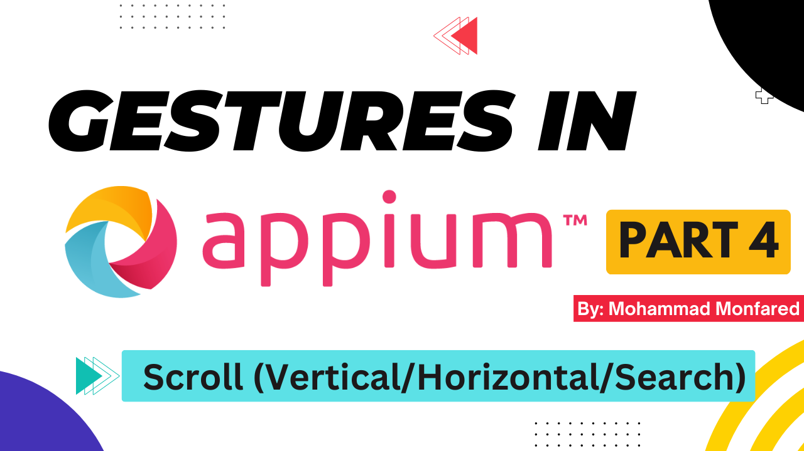
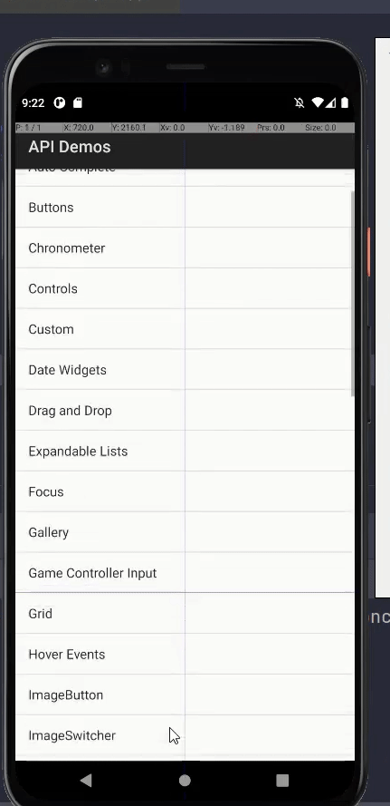
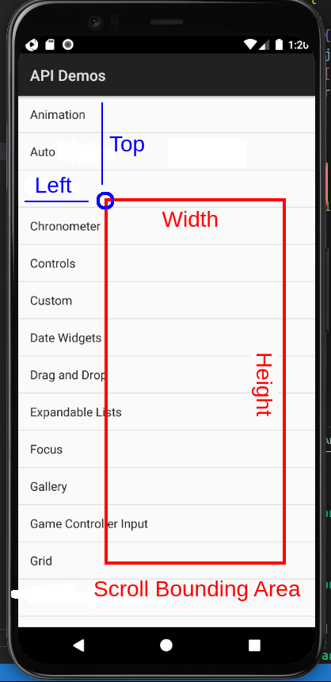
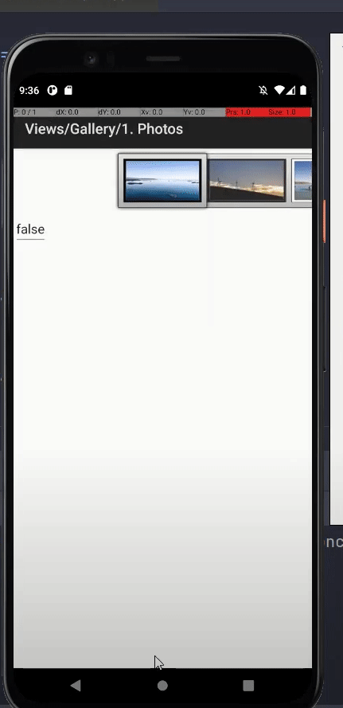
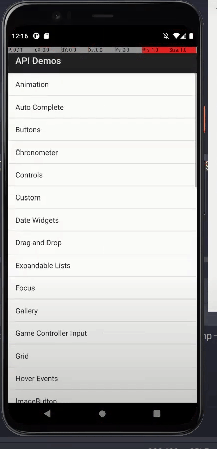
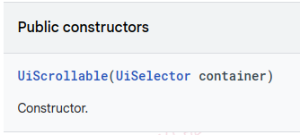
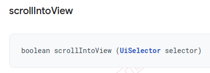

+++
title = 'Gestures in Appium - Part 4 - Scroll (Vertical/Horizontal/Search and Scroll Element IntoView)'
date = 2024-03-06T08:00:00+01:00
draft = false
tags = [
    "appium",
    "gestures",
]
categories = [
    "Mobile Automation"
]
series = ["Appium Gestures"]
+++

<p align="center" width="100%">
    
</p>

## Overview

This is the fourth part of the complete Gestures guide in the Appium series. In this guide, we will learn how to perform Scroll action in all directions (up/down/right/left) and search for elements using scroll to bring them into view (Scroll Element Into View).

## Scroll Up and Down using W3C Actions API

```python
from appium import webdriver
from appium.webdriver.common.appiumby import AppiumBy
from appium.options.android import UiAutomator2Options

import desired_caps # Explained in Part 1

appium_options = UiAutomator2Options().load_capabilities(desired_caps.apidemos)
driver = webdriver.Remote(appium_server, options=appium_options)
driver.find_element(by=AppiumBy.ACCESSIBILITY_ID, value='Views').click()

## Scroll Down
# Get origin element (Starting point)
buttons_el = driver.find_element(by=AppiumBy.ACCESSIBILITY_ID, value='Buttons')

# Get destination element (Ending point)
grid_el = driver.find_element(by=AppiumBy.ACCESSIBILITY_ID, value='Grid')

# Perform scroll using driverr.scroll()
driver.scroll(origin_el=grid_el, destination_el=buttons_el)

sleep(1)  # For demo purpose

## Scroll Up
grid_el = driver.find_element(by=AppiumBy.ACCESSIBILITY_ID, value='Grid')
picker_el = driver.find_element(by=AppiumBy.ACCESSIBILITY_ID, value='Picker')
driver.scroll(grid_el, picker_el)
```
<p align="center" width="100%">
    
</p>

To perform scrolling using W3C actions, we can utilize the `scroll()` method accessible through the driver instance (An `ActionHelpers` class' method). This method accepts starting and ending points as first and second arguments. Additionally, you can set the speed of the action (in milliseconds) as the third argument. This is optional and the default value is 600ms. `scroll(origin_el, destination_el, duration)`

## Scroll Up and Down using W3C Mobile Gestures Commands

```python
from appium import webdriver
from appium.webdriver.common.appiumby import AppiumBy
from appium.options.android import UiAutomator2Options

import desired_caps # Explained in Part 1

appium_options = UiAutomator2Options().load_capabilities(desired_caps.apidemos)
driver = webdriver.Remote(appium_server, options=appium_options)
driver.find_element(by=AppiumBy.ACCESSIBILITY_ID, value='Views').click()

# Scroll Down - with Element
list_view = driver.find_element(by=AppiumBy.ID, value='android:id/list')
driver.execute_script('mobile: scrollGesture', {
    'elementId': list_view,
    'direction': 'down',
    'percent': 2,
})

# Scroll Up - with Element
list_view = driver.find_element(by=AppiumBy.ID, value='android:id/list')
driver.execute_script('mobile: scrollGesture', {
    'elementId': list_view,
    'direction': 'up',
    'percent': 0.5,
    'speed': 1000
})
```

As mentioned before, performing actions with mobile gestures commands is easy, most-compatible, and cross-platform. The **"mobile: scrollGesture"** is the one we should pick to perform this gesture. Before talking about the code, let's take a look at the arguments this command accepts with the explanations from its documentation:

- **elementId**: The id of the element to be scrolled. If the element id is missing then a scroll bounding area must be provided. If both the element id and the scroll bounding area are provided then this area is effectively ignored.
- **left**: The left coordinate of the scroll bounding area
- **top**: The top coordinate of the scroll bounding area
- **width**: The width of the scroll bounding area
- **height**: The height of the scroll bounding area
- **direction**: Scrolling direction. Mandatory value. Acceptable values are: **up**, **down**, **left** and **right** (case insensitive)
- **percent**: The size of the scroll as a percentage of the scrolling area size. Valid values must be float numbers greater than zero, where 1.0 is 100%. Mandatory value.
- **speed**: The speed at which to perform this gesture in pixels per second. The value must not be negative. The default value is **"5000 * [displayDensity](https://en.wikipedia.org/wiki/Pixel_density)"**

**What is Scroll Bouding Area?** This term refers to the allowed area where we can scroll on a scrollable element. When we attempt to scroll on an element that is not scrollable, the gesture will either not work or will be disrupted. For example, when scrolling down (moving finger up), if we reach the status bar area, we cannot continue scrolling. Alternatively, if we start scrolling up (moving finger down) from the notification bar, it will open the notification center or quick settings button instead of scrolling. Therefore, the driver should know about this allowed area so that it doesn't move out of the scrollable area.

Now that we understand what the scrollable area is, We should know that there are two ways to define the scrollable area for mobile gesture commands like Scroll, Swipe, and Zoom (Pinch):

1. Pass the element object (`elementId`), and in this case, the bounding area would be the element bounds (as explained in [Part 1](https://blog.monfared.io/posts/gestures-in-appium-part1-history-rectangular-w3c-actions)).
Set the `top`, `left`, `width` and `height` values for it (in pixels), which is shown in the following figure:

<figure style="text-align: center;">
    
    <figcaption>Scroll Bounding Area</figcaption>
</figure>

**Important Note:** As mentioned just now, if you pass an **elementId** to the command, it will use the element's bounds to determine the scrolling area. So in our example, I passed the parent class of these elements (**list_view**) to be able to scroll the entire list. If I were to use any item from the list here instead of their parent element, it would limit the scrolling area to only one row (between two horizontal lines).

The **direction** and **speed** are clear. Let's talk about **perecnt**. It simply says how much of the scroll bounding area we want to scroll be performed. For example in the above figure, if I set 50% for this value, and **down** as direction, it will scroll from **Grid** to **Drag and Drop** items in this list.

**Hey, stop! I'm confused, we move our finger up (from down to up), so why do you call it scrolling Down and not Up?**

Let me make it even more confusing! For **swipe** we call vice versa (the one your brain accepts)! We say **Swipe Up** when swiping your finger from down to up and **Swipe down** when swiping from up to down! (We will see swipe gestures in the next posts). The same story with Left/Right scrolling/swiping.

But don't worry I will tell you know. 
**Scrolling:** Think about the scrollbar direction. When you're scrolling down a page or a list on a touchscreen device, you move your finger upwards on the screen. This action causes the content on the screen to move downwards, revealing more content. Conversely, when you're scrolling up, you move your finger downwards on the screen. This action causes the content on the screen to move upwards.

**Swiping:** When you're swiping down, you use a quick flicking motion where you move your finger downwards on the screen. In Swiping up, you move your finger upwards on the screen. Like switching between your photos in the phone gallery or dismissing a notification from the notification bar. In iOS devices, it reveals options like **delete** or **archive** for elements in a list like contacts or chat threads. 

- **Scrolling down**: Moving your finger upwards on the screen to move content downwards.

- **Scrolling up**: Moving your finger downwards on the screen to move content upwards.

- **Swiping down**: Using a quick flicking motion to move your finger downwards on the screen.

- **Swiping up**: Using a quick flicking motion to move your finger upwards on the screen.

## Scroll using TouchAction class

```python
from appium import webdriver
from appium.webdriver.common.appiumby import AppiumBy
from appium.options.android import UiAutomator2Options
from appium.webdriver.common.touch_action import TouchAction

import desired_caps # Explained in Part 1

appium_options = UiAutomator2Options().load_capabilities(desired_caps.apidemos)
driver = webdriver.Remote(appium_server, options=appium_options)
driver.find_element(by=AppiumBy.ACCESSIBILITY_ID, value='Views').click()
actions = TouchAction(driver)

# Scroll Down (passing element coordination)
up_el = driver.find_element(by=AppiumBy.ACCESSIBILITY_ID, value='Buttons')
down_el = driver.find_element(by=AppiumBy.ACCESSIBILITY_ID, value='Grid')
actions.press(el=down_el).move_to(x=up_el.location['x'], y=up_el.location['y']).release().perform()

# Scroll Up (passing element object)
grid_el = driver.find_element(by=AppiumBy.ACCESSIBILITY_ID, value='Grid')
picker_el = driver.find_element(by=AppiumBy.ACCESSIBILITY_ID, value='Picker')
actions.press(el=grid_el).move_to(el=picker_el).release().perform()
```
In the TouchAction class, we can achieve scrolling by chaining` press().move_to().release().perform()`. I think it is now crystal clear to you what we have done here. You can pass either element object or coordination for each action. Now I want to do something more interesting here:

```python
from appium import webdriver
from appium.webdriver.common.appiumby import AppiumBy
from appium.options.android import UiAutomator2Options
from appium.webdriver.common.touch_action import TouchAction

import desired_caps # Explained in Part 1

appium_options = UiAutomator2Options().load_capabilities(desired_caps.apidemos)
driver = webdriver.Remote(appium_server, options=appium_options)
driver.find_element(by=AppiumBy.ACCESSIBILITY_ID, value='Views').click()
actions = TouchAction(driver)

# Get origin/destination elements
up_el = driver.find_element(by=AppiumBy.ACCESSIBILITY_ID, value='Buttons')
down_el = driver.find_element(by=AppiumBy.ACCESSIBILITY_ID, value='Grid')

# Get these elements' coordination
up_el_coord = up_el.location
down_el_coord = down_el.location

# Get window size (Explained in Part 1)
window_size = driver.get_window_size()

# Calcualte center of the elements (Explained in Part 1)
down_el_x = window_size['width'] / 2 + down_el_coord['x']
up_el_x = window_size['width'] / 2 + up_el_coord['x']

# Perform Scroll using coordination
actions.press(x=down_el_x, y=down_el_coord['y']).move_to(x=up_el_x, y=up_el_coord['y']).release().perform()
```
We calculated the center of the elements and passed these values to our gesture sequence (from `down_el_x` to `up_el_x`) and the `y` is the same because we are performing vertical scroll.

## Scroll Right and Left using W3C Actions API

<p align="center" width="100%">
    
</p>

```python
from appium import webdriver
from appium.webdriver.common.appiumby import AppiumBy
from appium.options.android import UiAutomator2Options

import desired_caps # Explained in Part 1

appium_options = UiAutomator2Options().load_capabilities(desired_caps.apidemos)
driver = webdriver.Remote(appium_server, options=appium_options)
driver.find_element(by=AppiumBy.ACCESSIBILITY_ID, value='Views').click()
driver.find_element(by=AppiumBy.ACCESSIBILITY_ID, value='Gallery').click()
driver.find_element(by=AppiumBy.ACCESSIBILITY_ID, value='1. Photos').click()

# Scroll Right
image_views = driver.find_elements(AppiumBy.CLASS_NAME, value='android.widget.ImageView')
driver.scroll(image_views[2], image_views[0], duration=400)

# Scroll Left
image_views = driver.find_elements(AppiumBy.CLASS_NAME, value='android.widget.ImageView')
driver.scroll(image_views[0], image_views[2])
```
To perform a W3C-supported horizontal scroll (`driver.scroll()`) in the above screen, first, we find all image placeholders using `driver.find_elements()`:

```python
image_views = driver.find_elements(AppiumBy.CLASS_NAME, value='android.widget.ImageView')
```
then **for performing Scroll Right, we should move our finger from right to left**, so we choose the 3rd image (index 2 of the `image_views` list) as the origin and the first image (index 0) as the destination. Vice versa for **Scroll Left**.

## Scroll Right and Left using W3C Mobile Gestures Commands

```python
from appium import webdriver
from appium.webdriver.common.appiumby import AppiumBy
from appium.options.android import UiAutomator2Options

import desired_caps # Explained in Part 1

appium_options = UiAutomator2Options().load_capabilities(desired_caps.apidemos)
driver = webdriver.Remote(appium_server, options=appium_options)
driver.find_element(by=AppiumBy.ACCESSIBILITY_ID, value='Views').click()
driver.find_element(by=AppiumBy.ACCESSIBILITY_ID, value='Gallery').click()
driver.find_element(by=AppiumBy.ACCESSIBILITY_ID, value='1. Photos').click()

# Scroll Right - with Bounds
driver.execute_script('mobile: scrollGesture', {
    'left': 500, 'top': 500, 'width': 500, 'height': 0,
    'direction': 'right',
    'percent': 1.0
})

sleep(1)  # For demo purpose

# Scroll Left - with Bounds
driver.execute_script('mobile: scrollGesture', {
    'left': 500, 'top': 500, 'width': 500, 'height': 0,
    'direction': 'left',
    'percent': 1.0
})
```
## Scroll Right and Left using W3C Mobile Gestures Commands

```python
from appium import webdriver
from appium.webdriver.common.appiumby import AppiumBy
from appium.options.android import UiAutomator2Options

import desired_caps # Explained in Part 1

appium_options = UiAutomator2Options().load_capabilities(desired_caps.apidemos)
driver = webdriver.Remote(appium_server, options=appium_options)
driver.find_element(by=AppiumBy.ACCESSIBILITY_ID, value='Views').click()
driver.find_element(by=AppiumBy.ACCESSIBILITY_ID, value='Gallery').click()
driver.find_element(by=AppiumBy.ACCESSIBILITY_ID, value='1. Photos').click()

# Scroll Right - with Bounds
driver.execute_script('mobile: scrollGesture', {
    'left': 500, 'top': 500, 'width': 500, 'height': 0,
    'direction': 'right',
    'percent': 1.0
})

sleep(1)  # For demo purpose

# Scroll Left - with Bounds
driver.execute_script('mobile: scrollGesture', {
    'left': 500, 'top': 500, 'width': 500, 'height': 0,
    'direction': 'left',
    'percent': 1.0
})
```
To set the scrollable area for my emulator screen, I set a bounding area starting from point (500,500) on the screen (a point on the images). The width of the area was set to 500px, while the height was set to 0 since we are going to perform a horizontal scroll and it is a good practice. To scroll through the entire scrolling bounding area, I set the percent value to 1.0, indicating a 100% scroll.

## Android UiScrollable Class

Android developers are familiar with the [UiSelector()](https://developer.android.com/reference/android/support/test/uiautomator/UiSelector) and [UiScrollable()](https://developer.android.com/reference/android/support/test/uiautomator/UiScrollable) classes in Android SDK. These are parts of the Android **support-library** and are used to locate elements and do gestures on them in Android testing. Following is an example of how it is used (Java language).

```java
UiSelector element = new UiSelector().text("Accessibility");
element.click()
```
***Note for Android developers**: As of now (March 2024),  the `support-library` is recently **deprecated** and these classes are now maintained in AndroidX project which is an important component of Jetpack for testing. ( `import androidx.test.uiautomator.UiSelector` as an example for import)
Documentation: https://developer.android.com/reference/kotlin/androidx/test/uiautomator/package-summary*

Appium supports UiAutomator API with the help of `ANDROID_UIAUTOMATOR` selector. It is one of the `AppiumBy` strategies.

To locate an element using this selector we pass `AppiumBy.ANDROID_UIAUTOMATOR` as the `by` argument and the Java expression in string format for the `value`. e.g:

```python
el = driver.find_element(by=AppiumBy.ANDROID_UIAUTOMATOR, value='new UiSelector().text("Accessibility")')
```

Yes, it should be like this. **Even if you are using Java for Appium**, you must pass the value as a string with the Java expression!

## Scroll Element Into View (Search for element) using Android UiScrollable Class

<p align="center" width="100%">
    
</p>

Assuming you want to scroll in the page to find a specific element. Means that the driver bring that element into your view, so you can interact with it. The driver will search the entire scrollable area by scrolling in all possible directions and will find it for you regardless of where it is located. Let's see how we can achieve that using the library I just mentioned.

There is `UiScrollable()` class which can perform various gestures for us, such as `scrollToEnd `, `scrollBackward`, `flingForward `, etc. (You can refer to the [documentation](https://developer.android.com/reference/android/support/test/uiautomator/UiScrollable) for a list of available methods)

For creating a new instance of UiScrollable Class and using its `ScrollIntoView()` method we would say:

```java
new UiScrollable(UiSelector).scrollIntoView(UiSelector)
```
<p align="center" width="100%">
    
</p>

And we should pass another UiSelector object to the scrollIntoView method.

<p align="center" width="100%">
    
</p>

So the Java code would be:

```java
// Create an instance from UiSelector and make it scrollable
UiSelector scrollableSelector = new UiSelector().scrollable(true).instance(0);

// Cretae an instance of UiSelector and use its text() locator method
UiObject scrollableElement = new UiSelector().text("Picker").instance(0);

// Now join them together to create an instance of UiScrollable class
new UiScrollable(scrollableSelector).scrollIntoView(scrollableElement);
```
So we ended up with something crazy like this to write in our test! :

```python
java_value = 'new UiScrollable(new UiSelector().scrollable(true).instance(0)).scrollIntoView(new UiSelector().text("Picker").instance(0))'
el = driver.find_element(by=AppiumBy.ANDROID_UIAUTOMATOR, value=java_value)
```

`scrollable(true)` means that we want to create a scrollable UiSelector object and `instance(0)` will choose the first element found by that selector. Something like `driver.find_elements(By, Value)[0]`

And following is our final code:

```python
from appium import webdriver
from appium.webdriver.common.appiumby import AppiumBy
from appium.options.android import UiAutomator2Options

import desired_caps # Explained in Part 1

appium_options = UiAutomator2Options().load_capabilities(desired_caps.apidemos)
driver = webdriver.Remote(appium_server, options=appium_options)
driver.find_element(by=AppiumBy.ACCESSIBILITY_ID, value='Views').click()

# Using ANDROID_UIAUTOMATOR selector to find and element
el_to_find = driver.find_element(by=AppiumBy.ANDROID_UIAUTOMATOR, value='new UiScrollable(new UiSelector().scrollable(true).instance(0)).scrollIntoView(new UiSelector().text("Picker").instance(0))')
el_to_find.click()
```
## Scroll Element Into View (Search for element) using W3C Mobile Gestures Commands

```python
from appium import webdriver
from appium.webdriver.common.appiumby import AppiumBy
from appium.options.android import UiAutomator2Options

import desired_caps # Explained in Part 1

appium_options = UiAutomator2Options().load_capabilities(desired_caps.apidemos)
driver = webdriver.Remote(appium_server, options=appium_options)
driver.find_element(by=AppiumBy.ACCESSIBILITY_ID, value='Views').click()

#Scroll element into view
driver.execute_script('mobile: scroll', {'strategy': 'accessibility id', 'selector': 'Picker'})
```
There is a special gesture command in W3C Mobile Gestures which is `"mobile: scroll"`. It is intended to perform exactly what we want, scrolling to bring the element into view. As shown in the example provided, I passed the combination of strategy and selector instead of element or coordination.

## Scroll to End | Scroll to Beginning

```python
from appium import webdriver
from appium.webdriver.common.appiumby import AppiumBy
from appium.options.android import UiAutomator2Options

import desired_caps # Explained in Part 1

appium_options = UiAutomator2Options().load_capabilities(desired_caps.apidemos)
driver = webdriver.Remote(appium_server, options=appium_options)
driver.find_element(by=AppiumBy.ACCESSIBILITY_ID, value='Views').click()

# ScrollToEnd
driver.find_element(by=AppiumBy.ANDROID_UIAUTOMATOR, value='new UiScrollable(new UiSelector().scrollable(true)).setAsVerticalList().scrollToEnd(5)')

sleep(1)  # For demo purpose

#Scroll To Beginning 
driver.find_element(by=AppiumBy.ANDROID_U
```
Here, we are utilizing the Android UiScrollable class again. Let's review the new methods:

- `setAsVerticalList()` Sets the direction of swipes to be vertical when performing scroll actions.
- `setAsHorizontalList()` Sets the direction of swipes to be horizontal when performing scroll actions.
- `scrollToEnd(maxSwipes)` Scrolls to the end of a scrollable layout element 
- `scrollToBeginning(maxSwipes)` Scrolls to the beginning of a scrollable layout element

UiAutomator identifies the main scrollable element and scrolls to the beginning or end of the page. It is useful when you don't care about the contents and you just want to move the view into the most-top or most-down position.

Thank you for taking the time to read. If you enjoyed the post, please leave your reactions, comments, and questions. Your feedback is greatly appreciated!

In the next article, we will cover the Swipe gesture.

**Previous:** [Part 3 - Press and Hold (Long Press)](https://blog.monfared.io/posts/gestures-in-appium-part3-press-and-hold-long-press)

**Next:** [Part 5 - Swipe (Vertical/Horizontal)](https://blog.monfared.io/posts/gestures-in-appium-part5-swipe-vertical-horizontal)

Follow me on LinkedIn: https://www.linkedin.com/in/mohammad-monfared/

Happy testing ✌️


