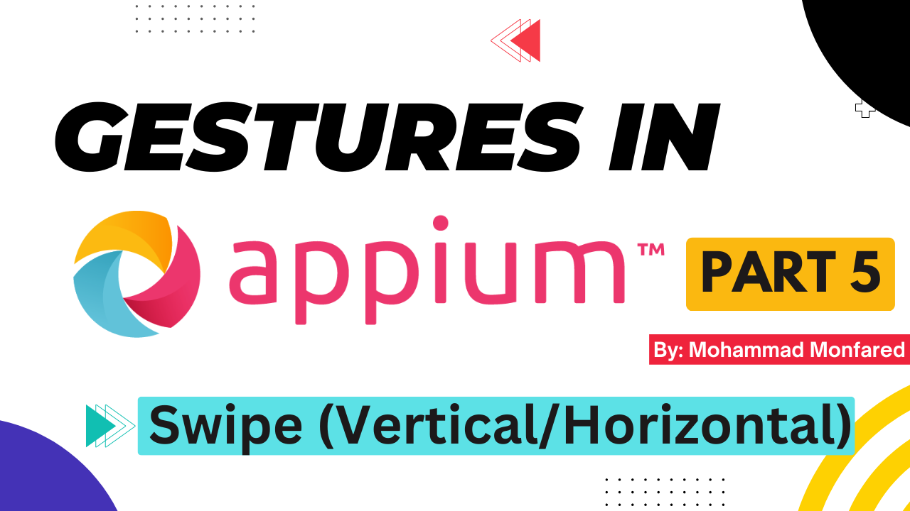
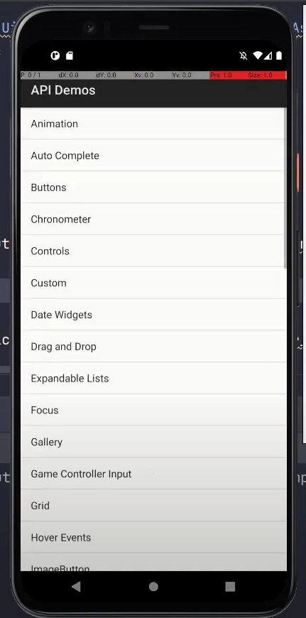
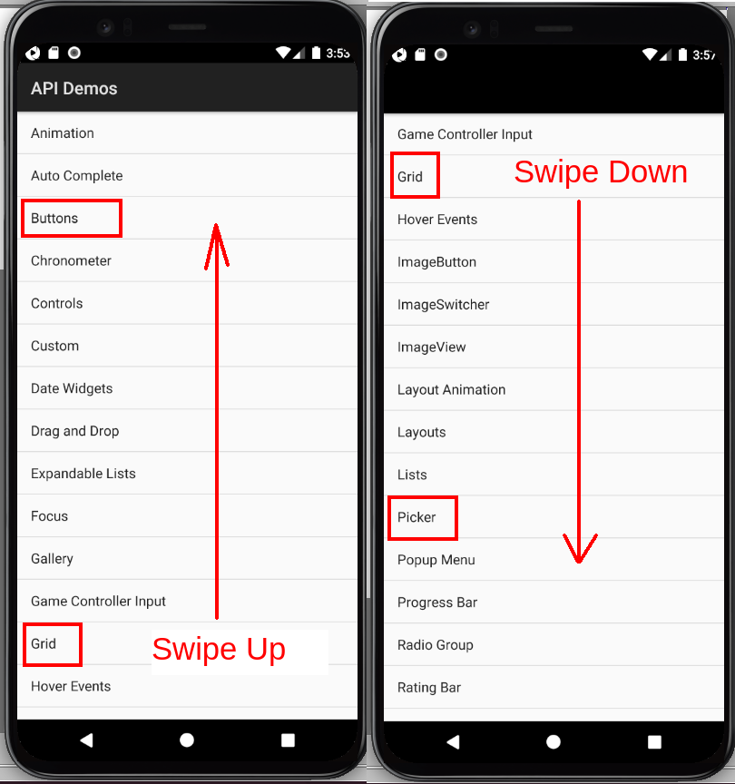
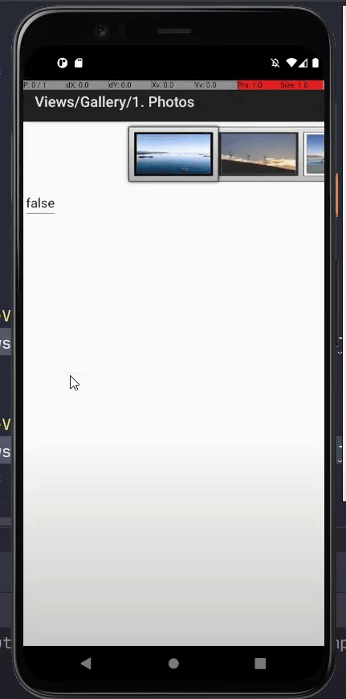

+++
title = 'Gestures in Appium - Part 5 - Swipe (Vertical/Horizontal)'
date = 2024-03-08T08:00:00+01:00
draft = false
tags = [
    "appium",
    "gestures",
]
categories = [
    "Mobile Automation"
]
series = ["Appium Gestures"]
+++

<p align="center" width="100%">
    
</p>

## Overview

This is the fifth part of the complete Gestures guide in the Appium series. In this guide, we will learn how to perform the Swipe action in all directions (up/down/right/left) which is something between Scroll and Flick (fling).

## What is the difference between Scroll, Swipe, and Flick (Fling)?

**Scroll:** Moving contents of the page within a container (scroll bounding area) to 4 main directions (up, down, left, right). It is performed slowly and in a controlled manner. **You release your finger at the end of the gesture, after you've moved the contents you're searching for into view**. The same action we do in desktop browsers and OS using the scrollbar or mouse wheel. We scroll to view content that extends beyond the visible area of a screen.

**Swipe:** A quick but **continuous** movement of the finger across the screen in a particular direction (usually up/down/right/left as a scroll). It is very close to scrolling but is much faster than it, and you usually don't control the finger or follow contents as a scroll. It is commonly used for various interactions, such as navigating between screens or pages in an app, revealing additional options or actions (e.g., swiping to delete an item in iOS), or switching between different views or tabs. 

**Flick (Fling):** It is a rapid movement of the finger across the screen as fast as possible. You don't care about contents and you don't control the finger movement. **You release your finger while performing a Flick.** For example, flicking up quickly and multiple times to reach the first message in a Telegram/WhatsApp thread or playing **Fruit Ninja Game!**

### Scroll DOWN = Swipe UP?? I'm confused

I discussed it in the previous part but let me quickly explain again. Think about the scrollbar: When you scroll down, you are moving the scrollbar down to view the contents that are not visible, and the contents are moving up, right? But we are talking about a touchscreen, and there is no mouse and scrollbars. You should scroll using your finger, so to do the same thing (moving elements up), what should you do? Correct, move your finger **UP** on the screen, not down. That's the difference in direction between Scroll and Swipe/Flick actions. For example, in Appium, when we want to move to the bottom of the page, we pass **direction=down** for Scroll, but pass **direction=up** if we want to use Swipe or Flick gestures. 
Now that we understand the differences, let's perform some Swipes!

Now that we understand the differences, let's perform some Swipes!

## Swipe Up and Down using W3C Actions API

<p align="center" width="100%">
    
</p>

```python
from appium import webdriver
from appium.webdriver.common.appiumby import AppiumBy
from appium.options.android import UiAutomator2Options

import desired_caps # Explained in Part 1

appium_options = UiAutomator2Options().load_capabilities(desired_caps.apidemos)
driver = webdriver.Remote(appium_server, options=appium_options)
driver.find_element(by=AppiumBy.ACCESSIBILITY_ID, value='Views').click()

buttons_el = driver.find_element(by=AppiumBy.ACCESSIBILITY_ID, value='Buttons')
grid_el = driver.find_element(by=AppiumBy.ACCESSIBILITY_ID, value='Grid')

# Swipe Up
driver.swipe(start_x=grid_el.location['x'], start_y=grid_el.location['y'], end_x=buttons_el.location['x'], end_y=buttons_el.location['y'])

# Swipe Down
grid_el = driver.find_element(by=AppiumBy.ACCESSIBILITY_ID, value='Grid')
picker_el = driver.find_element(by=AppiumBy.ACCESSIBILITY_ID, value='Picker')
driver.swipe(start_x=grid_el.location['x'], start_y=grid_el.location['y'], end_x=picker_el.location['x'], end_y=picker_el.location['y'])
```
The first and straightforward way to perform Swipe is to use `driver.swipe()` . An `ActionHelpers` class' method which is accessible through the driver instance. It accepts 4 mandatory and 1 optional argument including:

- **start_x**: x-coordinate at which to start
- **start_y**: y-coordinate at which to start
- **end_x**: x-coordinate at which to stop
- **end_y**: y-coordinate at which to stop 
- **duration**: defines the swipe speed as the time taken to swipe from point A to point B, in milliseconds.

So in the given example, first I found the starting and ending elements. Two simple rows named `buttons` / `grid`

```python
buttons_el = driver.find_element(by=AppiumBy.ACCESSIBILITY_ID, value='Buttons')
grid_el = driver.find_element(by=AppiumBy.ACCESSIBILITY_ID, value='Grid')
```
And then using their `location` property which gives me the coordination pair of the elements, (explained in [Part 1](https://blog.monfared.io/gestures-in-appium-part1-history-rectangular-w3c-actions)). I perform the Swipe Up gesture.

Then I performed **Swipe Down.**

**Why you queried driver_find() again for swiping up? Couldn't you just swap the coordination?** `element.location` actually queries the element again, While `grid_el` is still on the view (moved to the top) `button_el` is not causing the test to fail. Therefore I used `grid_el` as my starting point but found another element at the bottom of  this view to perform the action.

<p align="center" width="100%">
    
</p>

I intentionally did it this way to demonstrate what happens behind the scenes with the `location` property, so you won't be confused in the future. Now that we understand the concept, instead of querying the elements again, we can store the `location` value in a variable initially and then use it later. This way, we won't need to call the location again.

```python
from appium import webdriver
from appium.webdriver.common.appiumby import AppiumBy
from appium.options.android import UiAutomator2Options

import desired_caps # Explained in Part 1

appium_options = UiAutomator2Options().load_capabilities(desired_caps.apidemos)
driver = webdriver.Remote(appium_server, options=appium_options)
driver.find_element(by=AppiumBy.ACCESSIBILITY_ID, value='Views').click()

# Get elements
buttons_el = driver.find_element(by=AppiumBy.ACCESSIBILITY_ID, value='Buttons')
grid_el = driver.find_element(by=AppiumBy.ACCESSIBILITY_ID, value='Grid')

# Get coordinations
up_coords = {'x': buttons_el.location['x'], 'y': buttons_el.location['y']}
down_coords = {'x': grid_el.location['x'], 'y': grid_el.location['y']}

# Swipe Up
driver.swipe(start_x=down_coords['x'], start_y=down_coords['y'], end_x=up_coords['x'], end_y=up_coords['y'])

# Swipe Down
driver.swipe(start_x=up_coords['x'], start_y=up_coords['y'], end_x=down_coords['x'], end_y=down_coords['y'])
```

## Swipe Up and Down using W3C Mobile Gestures Commands

```python
from appium import webdriver
from appium.webdriver.common.appiumby import AppiumBy
from appium.options.android import UiAutomator2Options

import desired_caps # Explained in Part 1

appium_options = UiAutomator2Options().load_capabilities(desired_caps.apidemos)
driver = webdriver.Remote(appium_server, options=appium_options)
driver.find_element(by=AppiumBy.ACCESSIBILITY_ID, value='Views').click()

# Swipe Up - With Element
list_view = driver.find_element(by=AppiumBy.ID, value='android:id/list')
driver.execute_script('mobile: swipeGesture', {
    'elementId': list_view,
    'direction': 'up',
    'percent': 0.3,
    'speed': 5000
})

# Swipe Down - With Element
list_view = driver.find_element(by=AppiumBy.ID, value='android:id/list')
driver.execute_script('mobile: swipeGesture', {
    'elementId': list_view,
    'direction': 'down',
    'percent': 0.3,
    'speed': 3000
})
```
In W3C Mobile Gestures Commands, we have `mobile: swipeGesture`, which like most of the mentioned commands we covered so far, supports the following arguments (as mentioned in the documentation):
- **elementId**: The id (object) of the element to be swiped. If the element id is missing then swipe bounding area must be provided. If both the element id and the swipe bounding area are provided then the area is effectively ignored.
- **left**: The left coordinate of the swipe bounding area
- **top**: The top coordinate of the swipe bounding area
- **width**: The width of the swipe bounding area
- **height**: The height of the swipe bounding area
- **direction**: Swipe direction. Mandatory value. Acceptable values are: **up**, **down**, **left** and **right** (case insensitive)
- **percent**: The size of the swipe as a percentage of the swipe area size. Valid values must be float numbers in range 0..1, where 1.0 is 100%. Mandatory value.
speed: The speed at which to perform this gesture in pixels per second. The value must not be negative. The default value is `5000 * displayDensity`

So we either should pass the element object (found by `driver.find()`) or define the swiping bounding area which I explained well in the [previous part](https://blog.monfared.io/gestures-in-appium-part4-scroll-vertical-horizontal-search-scroll-element-intoview). Also, the `percent` which is the percentage of swiping as a float number (e.g. 0.2) is a mandatory value. There is no default. 
**Important Note:** I should reiterate in this post as well that if you pass an `elementId` to the command, it will use the element's bounds to determine the swiping area. So in our example, I passed the parent class of these elements (`list_view`) to be able to scroll the entire list. If I were to use any item from the list here instead of their parent element, it would limit the swiping area to only one row (between two horizontal lines).

## Swipe Left and Right using W3C Actions API

<p align="center" width="100%">
    
</p>

```python
from appium import webdriver
from appium.webdriver.common.appiumby import AppiumBy
from appium.options.android import UiAutomator2Options

import desired_caps # Explained in Part 1

appium_options = UiAutomator2Options().load_capabilities(desired_caps.apidemos)
driver = webdriver.Remote(appium_server, options=appium_options)
driver.find_element(by=AppiumBy.ACCESSIBILITY_ID, value='Views').click()
driver.find_element(by=AppiumBy.ACCESSIBILITY_ID, value='Gallery').click()
driver.find_element(by=AppiumBy.ACCESSIBILITY_ID, value='1. Photos').click()

# Swipe Left
image_views = driver.find_elements(AppiumBy.CLASS_NAME, value='android.widget.ImageView')
driver.swipe(image_views[2].location['x'], image_views[2].location['y'], image_views[0].location['x'], image_views[0].location['y'])

# Swipe Right
image_views = driver.find_elements(AppiumBy.CLASS_NAME, value='android.widget.ImageView')
driver.swipe(image_views[0].location['x'], image_views[0].location['y'], image_views[2].location['x'], image_views[2].location['y'])
```

In the above example, we have several images in a horizontal row. By the following command, we find all of them:

```python
image_views = driver.find_elements(AppiumBy.CLASS_NAME, value='android.widget.ImageView')
```
then we swipe from the 3rd one in the list (index 2) to the first one (index 0) by passing coordination of those elements.

```python
driver.swipe(image_views[2].location['x'], image_views[2].location['y'], image_views[0].location['x'], image_views[0].location['y'])
```
and vice-versa for swiping to the right. Note that we should find again the current elements in the view.

```python
image_views = driver.find_elements(AppiumBy.CLASS_NAME, value='android.widget.ImageView')
driver.swipe(image_views[0].location['x'], image_views[0].location['y'], image_views[2].location['x'], image_views[2].location['y'])
```

## Swipe Left and Right using W3C Mobile Gestures Commands

```python
from appium import webdriver
from appium.webdriver.common.appiumby import AppiumBy
from appium.options.android import UiAutomator2Options

import desired_caps # Explained in Part 1

appium_options = UiAutomator2Options().load_capabilities(desired_caps.apidemos)
driver = webdriver.Remote(appium_server, options=appium_options)
driver.find_element(by=AppiumBy.ACCESSIBILITY_ID, value='Views').click()
driver.find_element(by=AppiumBy.ACCESSIBILITY_ID, value='Gallery').click()
driver.find_element(by=AppiumBy.ACCESSIBILITY_ID, value='1. Photos').click()

# Swipe Left
galley = driver.find_element(by=AppiumBy.ID, value='io.appium.android.apis:id/gallery')
driver.execute_script('mobile: swipeGesture', {
    'elementId': galley,
    'direction': 'left',
    'percent': 0.3,
    'speed': 5000
})
# Swipe Right
galley = driver.find_element(by=AppiumBy.ID, value='io.appium.android.apis:id/gallery')
driver.execute_script('mobile: swipeGesture', {
    'elementId': galley,
    'direction': 'right',
    'percent': 0.3,
    'speed': 3000
})
```
the last thing I wanted to cover in this post is how to perform horizontal swiping using W3C mobile gestures commands. As you can see above, I set the `percent` to 0.3 in order to limit swiping to just a portion of the row. Additionally, I reduced the speed for right swiping to demonstrate its effect on the gesture.

Thank you for taking the time to read. If you enjoyed the post, please leave your reactions, comments, and questions. Your feedback is greatly appreciated!

In the next article, we will cover the **Flick (Fling)** gesture.

*Previous:* [Part 4 - Scroll (Vertical/Horizontal/Search and Scroll Element IntoView)](https://blog.monfared.io/gestures-in-appium-part4-scroll-vertical-horizontal-search-scroll-element-intoview)

*Next:* [Part 6 - Flick (Fling)](https://blog.monfared.io/gestures-in-appium-part6-flick-fling)

Follow me on LinkedIn: https://www.linkedin.com/in/mohammad-monfared/

Happy testing ✌️
