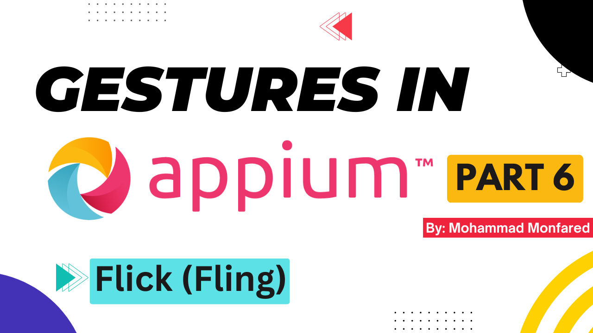
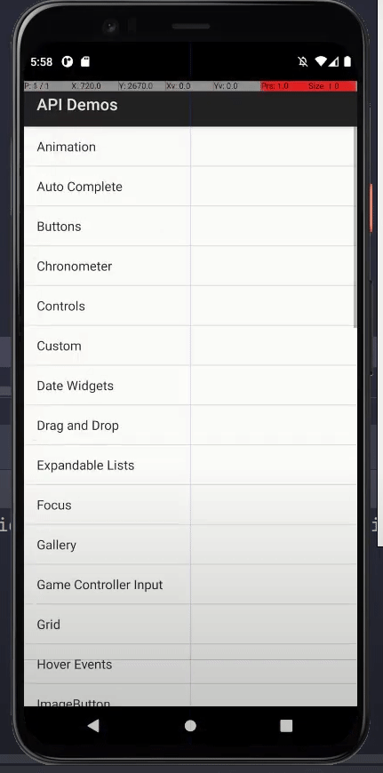

+++
title = 'Gestures in Appium - Part 6- Flick (Fling)'
date = 2024-03-09T08:00:00+01:00
draft = false
tags = [
    "appium",
    "gestures",
]
categories = [
    "Mobile Automation"
]
series = ["Appium Gestures"]
+++

<p align="center" width="100%">
    
</p>

## Overview

This is the sixth part of the complete Gestures guide in the Appium series. In previous posts, we familiarized ourselves with Scrolling and Swiping and now we will learn how to perform the **Flick** gesture action. This action is also called **Fling** or, in some places, **Flip**.

If you are not familiar with the differences between these gestures, please refer to the previous post where I explained it in detail. In short, Flicking is a quick action where exact locations are not important (although we need them for Appoium), and it should be as fast as possible. It's akin to swiftly cutting fruits in the FruitNinja game!

## Flick (Fling) using W3C Actions API

<p align="center" width="100%">
    
</p>

```python
from appium import webdriver
from appium.webdriver.common.appiumby import AppiumBy
from appium.options.android import UiAutomator2Options

import desired_caps # Explained in Part 1

appium_options = UiAutomator2Options().load_capabilities(desired_caps.apidemos)
driver = webdriver.Remote(appium_server, options=appium_options)
driver.find_element(by=AppiumBy.ACCESSIBILITY_ID, value='Views').click()
buttons_el = driver.find_element(by=AppiumBy.ACCESSIBILITY_ID, value='Buttons')
grid_el = driver.find_element(by=AppiumBy.ACCESSIBILITY_ID, value='Grid')

# Flick Up
driver.flick(start_x=grid_el.location['x'], start_y=grid_el.location['y'], end_x=buttons_el.location['x'], end_y=buttons_el.location['y'])

# Flick Down
grid_el = driver.find_element(by=AppiumBy.ACCESSIBILITY_ID, value='Grid')
picker_el = driver.find_element(by=AppiumBy.ACCESSIBILITY_ID, value='Picker')

driver.flick(start_x=250, start_y=900, end_x=250, end_y=2300)
```

As we saw in the previous post for `driver.swipe()` we also have driver.flick() which accepts the coordinates of the starting (`start_x`, `start_y`) and ending points (`end_x`, `end_y`). It doesn't accept a duration since it should be the fastest possible flick action.

## Flick (Fling) using W3C Mobile Gestures Commands

```python
from appium import webdriver
from appium.webdriver.common.appiumby import AppiumBy
from appium.options.android import UiAutomator2Options

import desired_caps # Explained in Part 1

appium_options = UiAutomator2Options().load_capabilities(desired_caps.apidemos)
driver = webdriver.Remote(appium_server, options=appium_options)
driver.find_element(by=AppiumBy.ACCESSIBILITY_ID, value='Views').click()

# Flick Up - Using elementId
list_view = driver.find_element(by=AppiumBy.ID, value='android:id/list')
list_view_rect = list_view.rect

driver.execute_script('mobile: flingGesture', {
    'elementId': list_view,
    'direction': 'down',
    'percent': 1,
})

# Flick Down - Using coordinates
driver.execute_script('mobile: flingGesture', {
    'left': list_view_rect['x'],
    'top': list_view_rect['y'],
    'direction': 'up',
    'width': list_view_rect['width'],
    'height': list_view_rect['height'],
    'percent': 2,
})
```

To perform a Flick gesture using W3C mobile gestures commands, we should use `mobile: flingGesture` which, like other commands we covered so far, allows us to either define a flick bounding area using (left, top, width, and height values) or pass the element object (in this case, the element bounding area is considered as flicking area)

That's it. That simple.


Thank you for taking the time to read. If you enjoyed the post, please leave your reactions, comments, and questions. Your feedback is greatly appreciated!

In the next article, we will cover the Drag-and-Drop gesture.

*Previous:* [Part 5 - Swipe (Vertical/Horizontal)](https://blog.monfared.io/gestures-in-appium-part5-swipe-vertical-horizontal)

*Next:* [Part 7 - Drag and Drop](https://blog.monfared.io/gestures-in-appium-part7-drag-and-drop)

Follow me on LinkedIn: https://www.linkedin.com/in/mohammad-monfared/

Happy testing ✌️