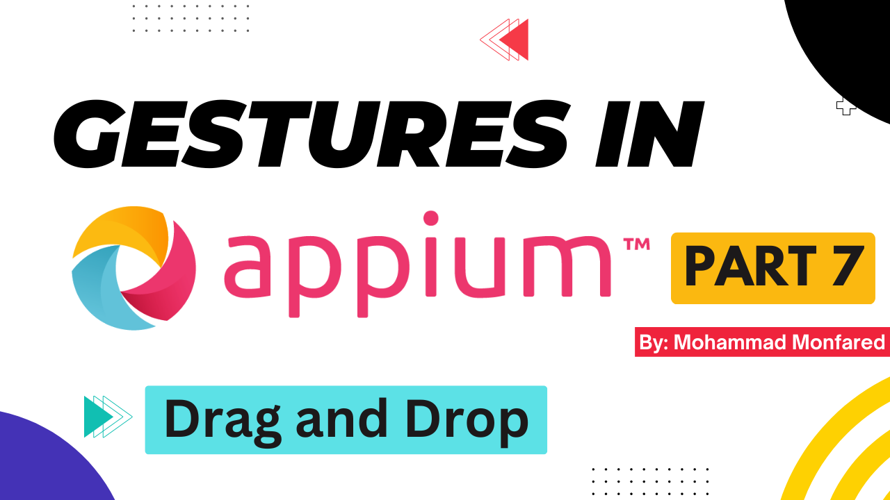
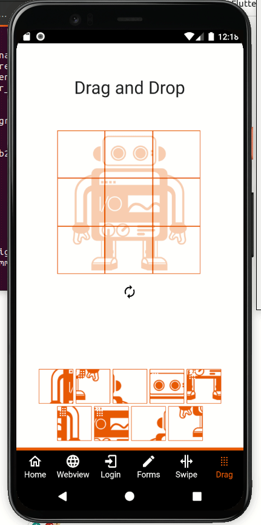

+++
title = 'Gestures in Appium - Part 7- Drag and Drop'
date = 2024-03-10T08:00:00+01:00
draft = false
tags = [
    "appium",
    "gestures",
]
categories = [
    "Mobile Automation"
]
series = ["Appium Gestures"]
+++

<p align="center" width="100%">
    
</p>

## Overview

This is the seventh part of the complete Gestures guide in the Appium series. In this guide, we will learn how to perform Drag and Drop action. It is one of the most important gestures in mobile automation, and mastering it is essential. Let's dive in!

### What is Drag and Drop? 

Well, the name defines itself. You pick something and drop it somewhere else, It consists of 4 actions:

1. Moving to point A (starting point)
2. Holding the finger to pick items
3. Dragging to point B (ending point)
4. Release the finger to drop

<p align="center" width="100%">
    
</p>

## Drag and Drop using W3C Actions API

```python
from appium import webdriver
from appium.webdriver.common.appiumby import AppiumBy
from appium.options.android import UiAutomator2Options

import desired_caps # Explained in Part 1

appium_options = UiAutomator2Options().load_capabilities(desired_caps.wdio)
driver = webdriver.Remote(appium_server, options=appium_options)
driver.implicitly_wait(5)
driver.find_element(AppiumBy.ACCESSIBILITY_ID, 'Drag').click()
draggable_el = driver.find_element(AppiumBy.ACCESSIBILITY_ID, 'drag-c1')
droppable_el = driver.find_element(AppiumBy.ACCESSIBILITY_ID, 'drop-c1')

driver.drag_and_drop(draggable_el, droppable_el)
```
The first and straightforward way to perform the Drag and Drop gesture is to use `driver.drag_and_drop(origin_el, destination_el)` , which accepts the origin and destination elements. Like `driver.swipe()` or `driver.scroll()` , it is another method of `ActionHelpers` class, accessible through the driver instance. So far we have learned all 5 ActionHelpers' methods to perform gestures:

- `driver.tap()`
- `driver.flick()`
- `driver.swipe()`
- `driver.scroll()`
- `driver.drag_and_drop()`

But this library is developing and we will see other methods in the future soon.

## Drag and Drop using W3C Mobile Gestures Commands

```python
from appium import webdriver
from appium.webdriver.common.appiumby import AppiumBy
from appium.options.android import UiAutomator2Options

import desired_caps # Explained in Part 1

appium_options = UiAutomator2Options().load_capabilities(desired_caps.wdio)
driver = webdriver.Remote(appium_server, options=appium_options)
driver.implicitly_wait(5)
driver.find_element(AppiumBy.ACCESSIBILITY_ID, 'Drag').click()
draggable_el = driver.find_element(AppiumBy.ACCESSIBILITY_ID, 'drag-c1')
droppable_el = driver.find_element(AppiumBy.ACCESSIBILITY_ID, 'drop-c1')

driver.execute_script('mobile: dragGesture', {
    'elementId': draggable_el,
    'endX': droppable_el.location['x'],
    'endY': droppable_el.location['y']
})
```
Let's first take a look at the supported arguments:

- `elementId`: The id of the element to be dragged. If the element id is missing then both start coordinates must be provided. If both the element id and the start coordinates are provided then these coordinates are considered as offsets from the top left element corner.
- `startX`: The x-start coordinate
- `startY`: The y-start coordinate
- `endX`: The x-end coordinate. Mandatory argument
- `endY`: The y-end coordinate. Mandatory argument
- `speed`: The speed at which to perform this gesture in pixels per second. The value must not be negative. The default value is `2500 * displayDensity`

As can be seen, we should either pass `elementId` (element object) or the coordinates of it (`startX`, `startY`) for our starting point. Additionally, for ending point, it only accepts coordinates (`endX`, `endY`).

Thank you for taking the time to read. If you enjoyed the post, please leave your reactions, comments, and questions. Your feedback is greatly appreciated!

In the next article, we will cover the Pinch (Zoom) gesture.

*Previous:* [Part 6 - Flick (Fling)](https://blog.monfared.io/posts/gestures-in-appium-part6-flick-fling)

*Next:* [Part 8 - Zoom (Pinch)](https://blog.monfared.io/posts/gestures-in-appium-part8-zoom-pinch)

Follow me on LinkedIn: https://www.linkedin.com/in/mohammad-monfared/

Happy testing ✌️