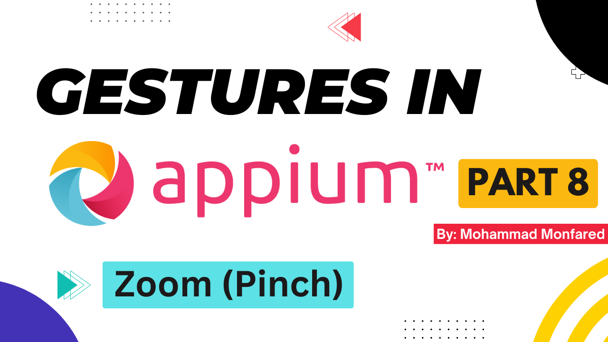
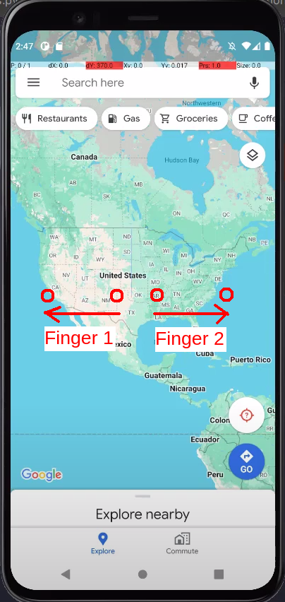
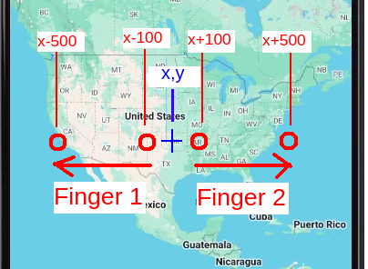

+++
title = 'Gestures in Appium - Part 8 - Zoom (Pinch)'
date = 2024-03-12T08:00:00+01:00
draft = false
tags = [
    "appium",
    "gestures",
]
categories = [
    "Mobile Automation"
]
series = ["Appium Gestures"]
+++

<p align="center" width="100%">
    
</p>

## Overview
This is the eighth part of the complete Gestures guide in the Appium series. In this guide, we will learn how to perform Zoom In/Out (Pinch) action. 

We do zooming to see the details, mostly on photos but sometimes on other elements like maps. 

During my career, I've rarely used this gesture, but it might be needed for some cases like automating maps/polygons. By the way, in order to finish the testing task you might need Visual Testing as well since the details on elements like maps or photos are not intractable.

<p align="center" width="100%">
    
</p>

### How to perform Zoom In/out (Pinch Open/Close) in Appium? 

Well. How do you do it manually? You put two fingers on the screen and then drag them in opposite directions. Right? Ok, In which direction? Up/down or right/left? The answer is clear, it isn't important. If the directions are exactly opposite it will perform zoom.

So we need 4 points on the screen:

1. Finger 1 starting point
2. Finger 1 ending point 
3. Finger 2 starting point
4. Finger 2 ending point

We can move our fingers in the same horizontal line (same **y**) right? So, this means the **x** coordinates only should be defined and all **y** coordinates can be the same. Now we just need 4 points as **x** coordinates.

<figure style="text-align: center;">
    
    <figcaption>Finger Directions in Zoom</figcaption>
</figure>

Now let's implement it.

## Zoom (Pinch) In/Out using W3C Mobile Gestures Commands

```python
from appium import webdriver
from appium.webdriver.common.appiumby import AppiumBy
from appium.options.android import UiAutomator2Options

import desired_caps # Explained in Part 1

appium_options = UiAutomator2Options().load_capabilities(desired_caps.maps)
driver = webdriver.Remote(appium_server, options=appium_options)
driver.implicitly_wait(10)
driver.find_element(by=AppiumBy.XPATH, value="//*[@text='SKIP']").click()
sleep(5)  # For demo purpose / wait to load maps

# Zoom In
driver.execute_script('mobile: pinchOpenGesture', {
    'left': 200,
    'top': 800,
    'width': 1000,
    'height': 1000,
    'percent': 0.5,
})

sleep(0.5)  # For demo purpose

# Zoom Out
driver.execute_script('mobile: pinchCloseGesture', {
    'left': 200,
    'top': 800,
    'width': 1000,
    'height': 1000,
    'percent': 1,
})
``` 
As you can see, there are two commands in W3C Mobile Actions to achieve this. `mobile: pinchOpenGesture` and `mobile: pinchCloseGesture`. Like most of the other commands we've covered so far, you should either pass the element to be pinched or define the pinch bounding area using a combination of `left`, `top`, `width` and `height` arguments. If you don't have any idea what the pinch/scroll/swipe bounding area is, please refer to [Part 4](https://blog.monfared.io/gestures-in-appium-part4-scroll-vertical-horizontal-search-scroll-element-intoview) where I explained it in detail.

## Zoom (Pinch) In/Out using Actions API - W3C

So far we have utilized previously created gesture methods in `ActionHelpers `. However, as mentioned in the [previous part](https://blog.monfared.io/gestures-in-appium-part7-drag-and-drop), it doesn't include  any gesture for pinching yet. Actually, `ActionHelper` class is just a (good and standard) sample of how we can create gestures using W3C Actions API. As noted in [Part 1](https://blog.monfared.io/gestures-in-appium-part1-history-rectangular-w3c-actions), we are not limited, we can create any gestures we can imagine using the W3C Actions API. 

With this understanding, I'm going to implement our Zoom In/out (Pinch Open/Close) methods using W3C Actions API. Let's first take a look at the final code, and I will provide a detailed explanation afterward.

```python
from appium import webdriver
from appium.webdriver.common.appiumby import AppiumBy
from appium.options.android import UiAutomator2Options

# To create our own W3C compatible gesture 
from selenium.webdriver.common.action_chains import ActionChains
from selenium.webdriver.common.actions.mouse_button import MouseButton

import desired_caps # Explained in Part 1

appium_options = UiAutomator2Options().load_capabilities(desired_caps.maps)
driver = webdriver.Remote(appium_server, options=appium_options)
driver.implicitly_wait(10)
driver.find_element(by=AppiumBy.XPATH, value="//*[@text='SKIP']").click()
sleep(5)  # For demo purpose / wait to load maps

# Get the size of the window
window_size = driver.get_window_size()

# Calculate center point on the screen
center_x = window_size['width']/2
center_y = window_size['height']/2
print(f'Center: {center_x}px, {center_y}px') # To check/demo in console

# Create an instance from ActionChains class
actions = ActionChains(driver)

# Free up any previously added input device (make sure to put in real projects)
actions.w3c_actions.devices = []

# Define two touch pointers (fingers)
finger1 = actions.w3c_actions.add_pointer_input('touch', 'finger1')
finger2 = actions.w3c_actions.add_pointer_input('touch', 'finger2')

# Zoom In
finger1.create_pointer_move(x=center_x-100, y=center_y)
finger1.create_pointer_down(button=MouseButton.LEFT)
finger1.create_pause(0.5)
finger1.create_pointer_move(x=center_x-500, y=center_y, duration=50)
finger1.create_pointer_up(button=MouseButton.LEFT)

finger2.create_pointer_move(x=center_x+100, y=center_y)
finger2.create_pointer_down(button=MouseButton.LEFT)
finger2.create_pause(0.5)
finger2.create_pointer_move(x=center_x+500, y=center_y, duration=50)
finger2.create_pointer_up(button=MouseButton.LEFT)

actions.perform()
sleep(0.5)  # For demo purpose

# Zoom Out
finger1.create_pointer_move(x=center_x-500, y=center_y)
finger1.create_pointer_down(button=MouseButton.LEFT)
finger1.create_pause(0.5)
finger1.create_pointer_move(x=center_x-100, y=center_y, duration=50)
finger1.create_pointer_up(button=MouseButton.LEFT)

finger2.create_pointer_move(x=center_x+500, y=center_y)
finger2.create_pointer_down(button=MouseButton.LEFT)
finger2.create_pause(0.5)
finger2.create_pointer_move(x=center_x+100, y=center_y, duration=50)
finger2.create_pointer_up(button=MouseButton.LEFT)

actions.perform()
```

First I calculated the center point on the screen by dividing the window height and width by 2:

```python
# Get the size of the window
window_size = driver.get_window_size()

# Calculate center point on the screen
center_x = window_size['width']/2
center_y = window_size['height']/2
```

Next, I created an instance from the ActionChains class and cleared any previously added input device. You should do this in real projects since you might use the same ActionChains instance across your tests.

```python
# Create an instance from ActionChains class
actions = ActionChains(driver)

# Free up any previously added input device (make sure to put in real projects)
actions.w3c_actions.devices = []
``` 
Now we need two fingers! In the following code, `actions` is our instance of `ActionChains` class,  and `w3c_actions` means we are going to use W3C Actions API. But what is `add_pointer_input` ? 

As explained in [W3C Actions API](https://w3c.github.io/webdriver/#actions) Standard and [Part 1](https://blog.monfared.io/gestures-in-appium-part1-history-rectangular-w3c-actions) of this series, we have 3 types of input: (`key`, `pointer`, `wheel`). We should use `pointer` since it is neither a Keyboard nor a Mouse Wheel. Our input is going to be a pointer. Now, for pointers, we also have three types: (`touch`, `pen`, `mouse`). So we use `touch` input since we are going to perform actions by touching the screen, not by a Pen or a Mouse connected.

```python
# Define two touch pointers (fingers)
finger1 = actions.w3c_actions.add_pointer_input('touch', 'finger1')
finger2 = actions.w3c_actions.add_pointer_input('touch', 'finger2')
```
Ok, now we actually need to perform a drag and drop with each finger. One to the left and one to the right. As mentioned in the [previous part](https://blog.monfared.io/gestures-in-appium-part7-drag-and-drop), drag and drop means (move to A > hold > move to B> release). 

However, we should do them together somehow. We can't perform one finger's gesture and then the next one after it. They should be performed simultaneously. That's why we have the `perform()` method in `ActionChains` class. We define all our actions and then perform them all together.

So, for zooming in, we will have:

```python
# Zoom In
finger1.create_pointer_move(x=center_x-100, y=center_y)
finger1.create_pointer_down(button=MouseButton.LEFT)
finger1.create_pause(0.5)
finger1.create_pointer_move(x=center_x-500, y=center_y, duration=50)
finger1.create_pointer_up(button=MouseButton.LEFT)

finger2.create_pointer_move(x=center_x+100, y=center_y)
finger2.create_pointer_down(button=MouseButton.LEFT)
finger2.create_pause(0.5)
finger2.create_pointer_move(x=center_x+500, y=center_y, duration=50)
finger2.create_pointer_up(button=MouseButton.LEFT)

actions.perform()
```
and for zooming out:

```python
# Zoom Out
finger1.create_pointer_move(x=center_x-500, y=center_y)
finger1.create_pointer_down(button=MouseButton.LEFT)
finger1.create_pause(0.5)
finger1.create_pointer_move(x=center_x-100, y=center_y, duration=50)
finger1.create_pointer_up(button=MouseButton.LEFT)

finger2.create_pointer_move(x=center_x+500, y=center_y)
finger2.create_pointer_down(button=MouseButton.LEFT)
finger2.create_pause(0.5)
finger2.create_pointer_move(x=center_x+100, y=center_y, duration=50)
finger2.create_pointer_up(button=MouseButton.LEFT)

actions.perform()
```
> What are ("x-100", "x+100", "x-500" and "x+500")?

<figure style="text-align: center;">
    
    <figcaption>Fingers Coordinates in Appium Zoom Gesture</figcaption>
</figure>

In this figure, (`x`, `y`) represents our center point (`center_x`, `center_y`).

Finger 1 starting point : (`x-100`, `y`)
Finger 1 ending point : (`x-500`, `y`)
Finger 2 starting point : (`x+100`, `y`)
Finger 2 ending point : (`x+500`, `y`)

So, we start from a distance of 100 pixels from the center to avoid collisions with our fingers. Then we move our left finger 400 pixels to the left (from `x-100` to `x-500`) and move our right finger 400 pixels to the right (from `x+100` to `x+500`). All this is done along the same horizontal line (`y` remains constant).

> What is `MouseButton.LEFT` ?

The `MouseButton` class is a kind of enum that indicates the button of the input we want to perform the action with. For example, you might want to use the middle or right button of the mouse to perform an action. In touch input, since there is only a finger, we use the primary and default input button, which is 0 or `MouseButton.LEFT`.

```python
class MouseButton:
    LEFT = 0
    MIDDLE = 1
    RIGHT = 2
    BACK = 3
    FORWARD = 4
```
> Hey, I am confused. We are doing touch actions here. Why are you talking about the Mouse?

Well, as mentioned many times, Appium is built on top of the Selenium and uses the same `TouchActions` class to implement gestures, and that's the reason we utilize Selenium libraries in many cases.

To achieve **Zoom out** we do all the actions vice versa by simply swapping starting and ending points.

Thank you for taking the time to read. If you enjoyed the post, please leave your reactions, comments, and questions. Your feedback is greatly appreciated!

In the next article, we will talk about a Plugin available for performing gestures.

*Previous:* [Part 7 - Drag and Drop](https://blog.monfared.io/gestures-in-appium-part7-drag-and-drop)

*Next:* [Part 9 - Gestures Plugin](https://blog.monfared.io/gestures-in-appium-part9-plugin)

Follow me on LinkedIn: https://www.linkedin.com/in/mohammad-monfared/

Happy testing ✌️